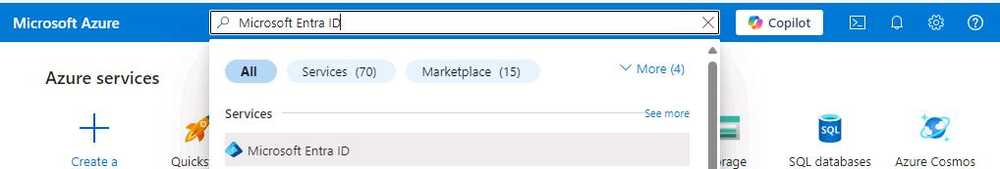
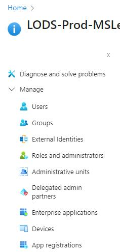
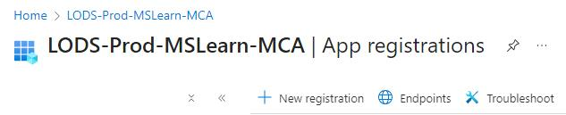
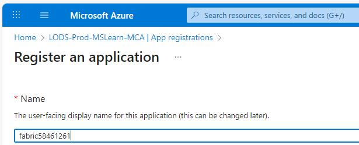
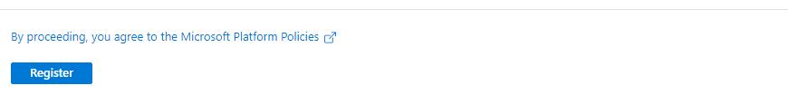
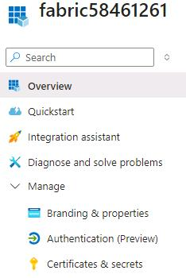
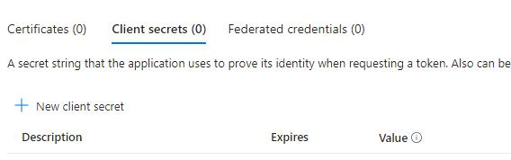
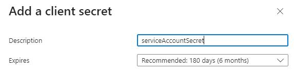
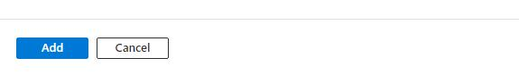
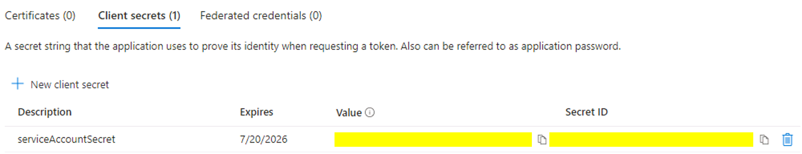

## Task 01: Configure a service account and secret

### Introduction
Using a service principal and secret to access Databricks workspaces ensures secure authentication and authorization for programmatic interactions. The service principal and secret separate sensitive credentials, allow fine-grained control over permissions, and enable applications to securely access Databricks resources while adhering to the principal of least privilege.

In this task, you'll create a service account and secret for an existing app registration.

### Learning resources
- [Register a Microsoft Entra app and create a service principal](https://learn.microsoft.com/en-us/entra/identity-platform/howto-create-service-principal-portal "Register a Microsoft Entra app and create a service principal")

### Key steps

1. Open a browser and go to [**Azure Portal**](https://portal.azure.com/). Sign in by using your credentials.

    | Setting | Value |
    |:---------|:---------|
    | Username   | **Your Azure Username**   |
    | Password   | **Your Azure Password**   |

1. On the Azure Home page, in the **Search** field, search for and select `Microsoft Entra ID`.

    

1. On the **Microsoft Entra ID Overview** page, in the left pane, select **Manage** and then select **App registrations**.

    

1. On the command bar, select **+ New registration**.

    

1. On the **Register an Application** page, in the **Name** field, enter `fabric@lab.LabInstance.Id`.

    

    {: .note }
    > For this lab, we use an 8-digit number as part of the name for any resources that you created. The 8-digit number is unique for this lab instance.
    >
    > The screenshots use the lab instance number that was generated when we were capturing screenshots. Your lab instance number will differ from the screenshots.

1. At the bottom of the **Register an application** page, select **Register**. You are returned to the App registration page for **fabric@lab.LabInstance.Id**.

    

1. In the left pane, select **Overview**.

1. On the **Overview** page, locate the **Essentials** section at the top of the page. Paste the values for the following settings into the appropriate text fields:

    | Default | Value | 
    |:---------|:---------| 
    | Display name   | **The name of your service account (e.g., MyServiceAccount)**   | 
    | Application (client) ID  | **The unique identifier for your app (e.g., [Your Application (client) ID])**   | 
    | Directory (tenant) ID  | **The unique identifier for your directory (e.g., [Your Directory (tenant) ID])**   | 

    {: .warning }
    > Be sure to move the mouse cursor outside of the text field after pasting text. This ensures that the lab environment will save the values for use later in the lab. 

    
1. In the left pane, select **Manage** and then select **Certificates & secrets**.

    

1. Select the **Client secrets** tab and then select **+ New client secret**.

    

1. In the **Add a client secret** pane, in the **Description** field, enter `serviceAccountSecret`. Then, select **Add**.

    
    

1. On the **Certificates & secrets** page for **fabric@lab.LabInstance.Id**, locate the secret that you just created. 

    

1. []Copy the following values for **Description** and **Value** and paste these values into the appropriate text fields:

    >| Default | Value |
    |:---------|:---------|
    | Description   | @lab.TextBox(secretDescription)   |
    | Value   | @lab.TextBox(secretValue)   |

    {: .warning }
    > After you save the client secret, the value of the client secret is displayed. After you navigate away from the **Certificates & secrets** page, the value of the secret will no longer be available. Save the value in Notepad or elsewhere.

1. Leave the Azure page open. 
