## Task 02: Add a role assignment to an Azure Storage account

### Introduction
Zava plans to acquire Litware, Inc. and must be able to access data from Litware.

### Description
In this task, you'll add a role assignment so that your user account and the app that you registered in the previous task can connect to the storage account where you'll store Litware data. 
### Example scenario
Zava's data engineering team needs controlled access to Litware's data stored in Azure Data Lake Storage. By assigning roles to both users and applications, Zava ensures that data pipelines and analytics tools can securely read and write data without exposing unnecessary permissions.

### Success criteria
You've successfully completed this task when both your user account and the registered application can access the Litware storage account using the assigned role.

### Learning resources
- [**Introduction to Azure Data Lake Storage Gen2**](https://learn.microsoft.com/en-us/azure/storage/blobs/data-lake-storage-introduction "Introduction to Azure Data Lake Storage Gen2")

### Key steps

#### 01: Grant storage access to the service principal and user account

1. Return to the Azure web page.

1. in the **Search** field, search for and select `Storage accounts`.

    {: .warning }
    > Be sure to use **Storage accounts** and not **Storage accounts (classic)**. The instructions and screenshots will not be correct if you use **Storage accounts (classic)**.

1. Select the **litwaredata@lab.LabInstance.Id** storage account.

    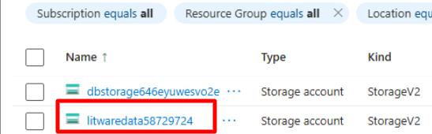

1. In the left pane, select **Access Control (IAM)**.

    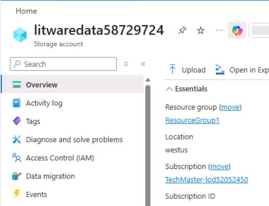

1. In the **Grant access to this resource** tile, select **Add role assignment**.

    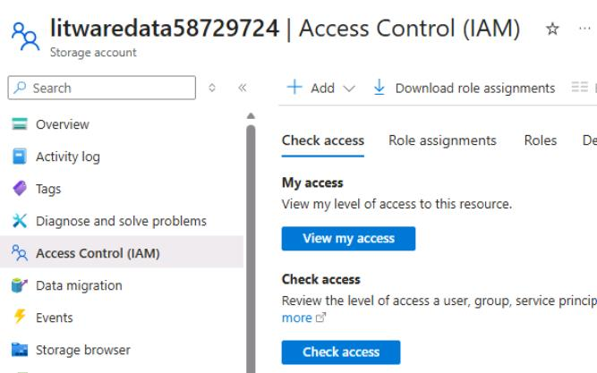

1. At the top of the list of roles, in the **Search** field, enter `Storage Blob Data Contributor`.

    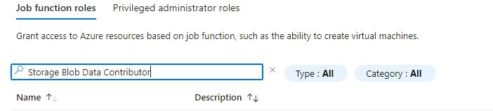

1. Select **Storage Blob Data Contributor** from the search results and then select **Next**.

    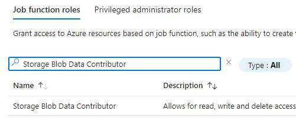
    

    {: .warning }
    > You must select **Storage Blob Data Contributor** from the list of search results before you select **Next** to ensure that you add members correctly to the role.

1. On **Add role assignment** page, select the **Members** tab. Then, in the **Members** section, select **+ Select members**.

    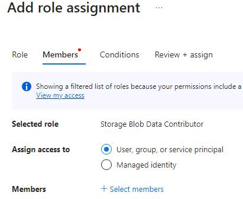

    {: .note }
    > You'll add two members for this role assignment. 

1. In the **Select members** pane, in the **Search** field, enter the following value and then select the member from the search results:

    `@lab.CloudPortalCredential(User1).Username`

1. Select **Select**.

    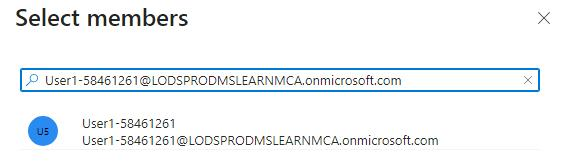
    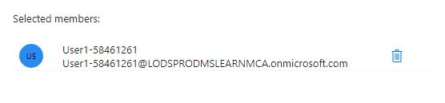 
       

1. On the **Add role assignment** page, select **+ Select members** to add the second member.

    

1. In the **Select members** search box, enter `fabric@lab.LabInstance.Id` and then select the member from the search results. Select **Select**.

    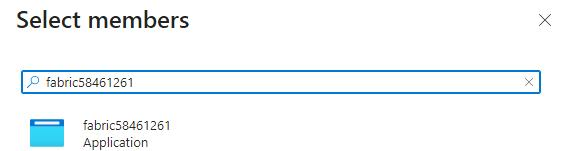
    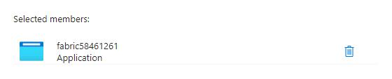
    

1. On the **Add role assignment** page, select **Review + assign** twice.

    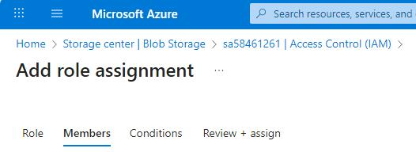
    

1. Leave the Azure page open.