# Task 03: Upload data to the litwareuc storage account

### Introduction
Before Fabric and Databricks can work with Litware's data, the data must be uploaded into Azure Data Lake Storage. In this task, you'll create a container and upload the source datasets that will be used throughout the lab.

### Description
In this task, you'll create a container in the litwareuc@lab.LabInstance.Id storage account. Then, you'll upload data to the container. 

### Example scenario
Litware has shared historical sales, product, and website data with Zava. This data needs to be stored centrally so it can be accessed by Fabric lakehouses and Databricks pipelines.

### Success criteria
The Litware storage account contains all required folders and files, and the data is visible in the storage container.

### Learning resources
*   Azure Storage Explorer overview
*   Azure Data Lake Storage Gen2 fundamentals

### Key tasks
#### 01: Get the access key for the storage account
1. On the Azure home page, in the **Search** field, search for and select `Storage accounts`.

    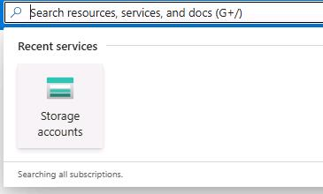

    >[!alert] Be sure to use **Storage accounts** and not **Storage accounts (classic)**. The instructions and screenshots will not be correct if you use **Storage accounts (classic)**.

1. On the **Storage Accounts** page, select **litwareuc@lab.LabInstance.Id**.

    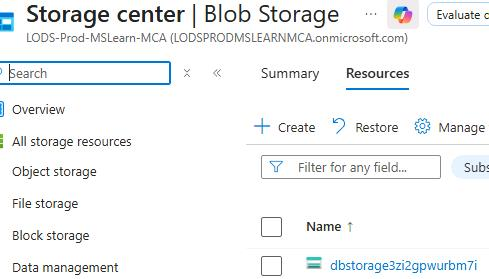

1. In the left pane, select **Security + networking** and then select **Access keys**.

    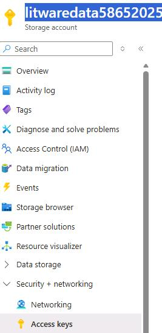

1. In the **key1** section, in the **Key** field, select **Show**.

    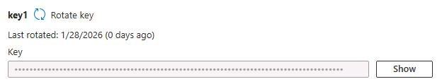

1. Copy the key and paste it into the following text field. You'll use the key later in the workshop to create a shortcut from the Fabric workspace to the data.

    @lab.TextBox(LitWareDataAccessKey)

---

#### 02: Upload files to the storage account
1. On the virtual machine taskbar, select the shortcut to launch **Azure Storage Explorer**.

1. Select **Sign in with Azure**.

1. In the **Select Azure environment** dialog, select **Azure** and then select **Next**.

    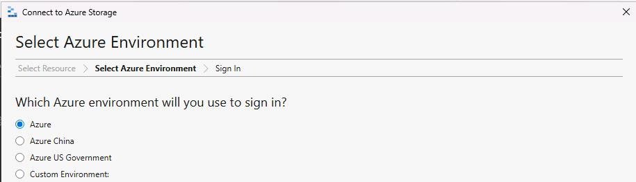
    

1. Sign in by using the following credentials:

    | Setting | Value |
    |:---------|:---------|
    | Username   | `@lab.CloudPortalCredential(User1).Username`   |
    | Temporary Access Pass (TAP) token   | `@lab.CloudPortalCredential(User1).AccessToken`   |

1. On the **Account Management** pane, select **Open Explorer**.

    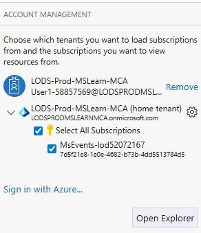

1. In the **Explorer** pane, expand the folder with the key symbol and then expand **Storage Accounts**. 

    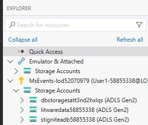

1. Expand **litwareuc@lab.LabInstance.Id**. 

    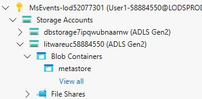

1. Right-click **Blob Containers** and then select **Create Blob Container**.

    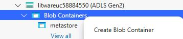

1. In the text field, enter `litwaredata` and then select **Enter**.

   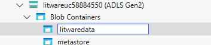

1. On the new tab that opens, on the command bar, select **Upload** and then select **Upload Folder**.

    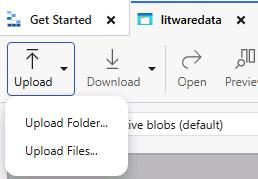

1. In the **Upload Folder** dialog, in the **Selected folder** field, select the ellipses (**...**).

    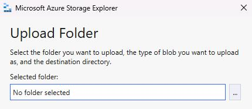

1. In the **Choose folder to upload** dialog, go to `C:\Lab Assets\LitwareData`. Select **data** and then select **Select folder**.

    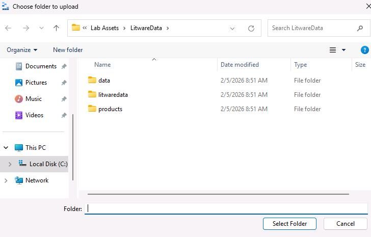

1. Select **Upload**.

    

1. Wait while the files upload.

1. Repeat Steps 10-14 to upload the **litwaredata** and **Products** folders.

1. In the **litwaredata** pane, verify that all three folders are listed and that there are files in each folder. 

    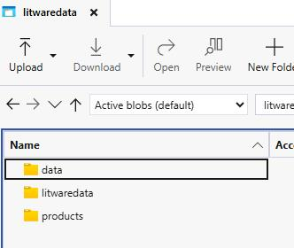

1. Close Azure Storage Explorer.