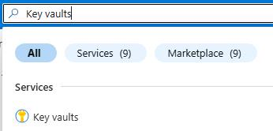
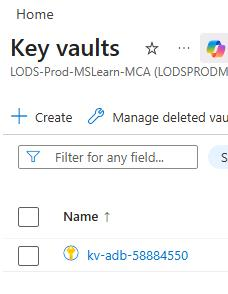
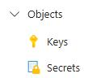
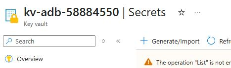
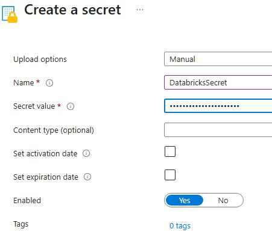
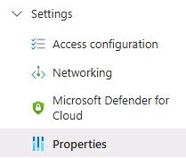
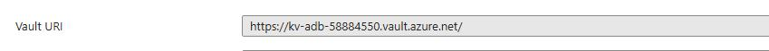
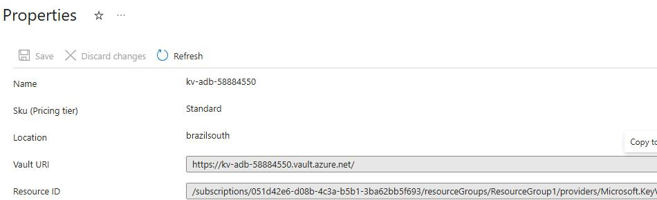

## Task 4: Generate a key for Databricks in Key Vault

In this task, you'll generate a key in Azure Key Vault. The key will be used later in the workshop to allow access to resources.

1. Return to the Azure web page.

1. In the **Search** field, search for and select `Key vaults`.

    

1. Select the **kv-adb-@lab.LabInstance.Id** key vault.

    

1. In the left pane, expand **Objects** and select **Secrets**.

    

1. On the command bar, select **+ Generate/Import**.

    

1. Configure the secret by entering the following values and then select **Create**.

    | Field | Value |
    |---------|---------|
    | Name   | `DatabricksSecret`   |
    | Value  | `SecretValueFor@lab.LabInstance.Id`   |

    

1. In the left pane, expand **Settings** and select **Properties**.

    

1. In the **Vault URI** field, copy the value.

    

1. Paste the value into a Notepad file, for later use.

1. In the **Resource ID** field, copy the value.

    

1. Paste the value into a Notepad file, for later use.

1. Leave the Azure page open.