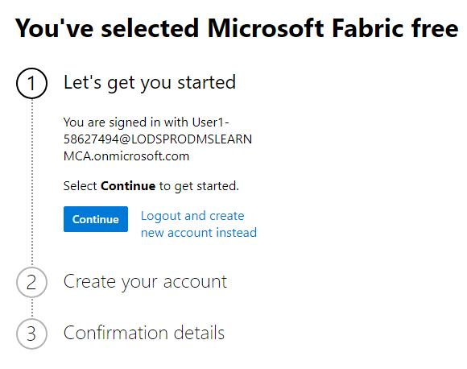
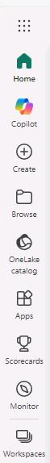
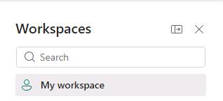
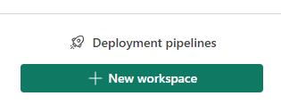
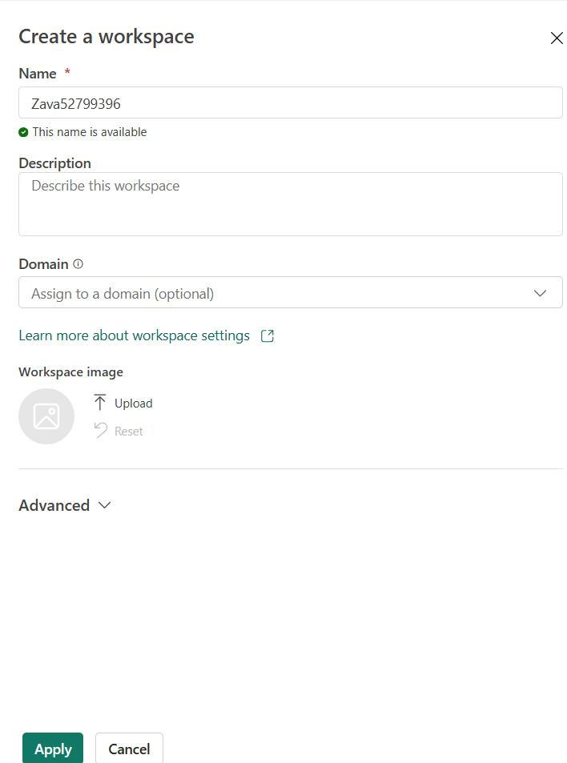
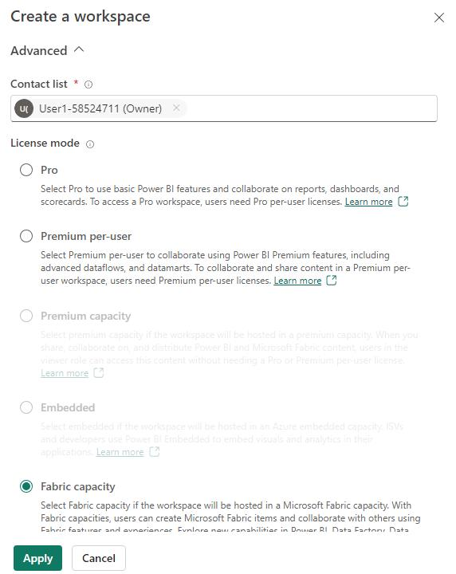
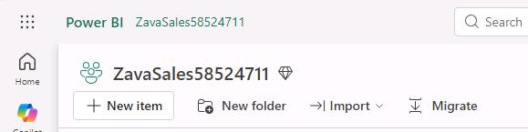
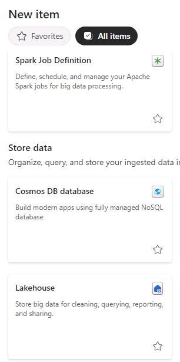
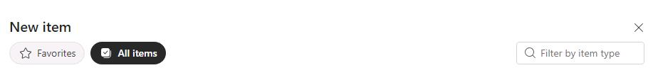
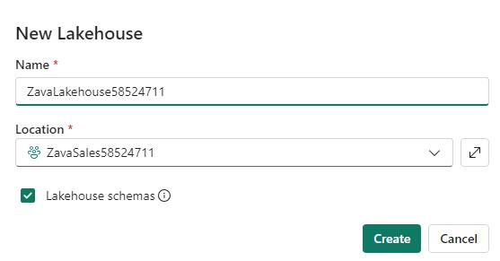

## Task 01: Create a Microsoft Fabric-enabled workspace and add lakehouses

### Introduction
In this task, you'll create a workspace and then add a lakehouse to the workspace.

### Key steps

#### 01: Create a workspace

1. Open Microsoft Edge and go to [Power BI](https://app.powerbi.com/).

1. If prompted, sign in.

    {: .warning }
    > When you sign in, you may see a message that resembles the screenshot below. If you see this page, close the browser and repeat Step 1 of this task.
    >
    >
    
1. In the left pane, select **Workspaces**.

    

1. On the **Workspaces** pane, select **+ New workspace**.

	
    

1. In the **Create a workspace pane**, in the **Name** field, enter `ZavaSales@lab.LabInstance.Id`.

	

1. In the **Create a workspace** pane, expand the **Advanced** node. 

    

1. Ensure that **Fabric capacity** is selected and then select **Apply**.

	{: .warning }
    > When you first expand the **Advanced** node, if **Fabric capacity** is not selected, wait 30-60 seconds for the pane to update.
    >
    > Alert your coach if **Fabric capacity** never becomes selected.

---

#### 02: Create a lakehouse for Zava data

1. At the top left of the **Workspace** page, select **+ New item**.

	

1. In the new item pane, move down to the **Store data** section and then select **Lakehouse**.

    

	{: .important }
    > You can also use the **Filter by item type** field to locate an item.
    >
    >

1. In the **New lakehouse** dialog, in the **Name** field, enter  `ZavaLakehouse@lab.LabInstance.Id`.

1. Select the **Lakehouse schemas** checkbox and then select **Create**.

	

	{: .note }
    > Wait while the lakehouse loads. Fabric creates the lakehouse and then adds a SQL endpoint and a default semantic model. 
    >
    > There is no need to set up any storage accounts or worry about configuring networks, infrastructure, key vaults, Azure subscriptions, or other resources.

1. Leave the Fabric page open.