## Task 02: Create a shortcut to reference external data 

### Introduction
Shortcuts in a lakehouse allow users to reference data without copying the data. Shortcuts unify data from different lakehouses, eventhouses, workspaces, and external storage. You can quickly make large amounts of data available in your lakehouse locally without the latency of copying data from sources.

In this task, you will create a shortcut that references curated bounce rate data for Litware from ADLS Gen2 storage. Bounce rate is a web analytics metric that measures the percentage of visitors who land on a website and then leave without interacting with any other page or element on the site.

### Key tasks

1. Open Microsoft Edge and go to `https://app.powerbi.com/`.

1. If prompted, sign in.

1. In the left pane, select **Workspaces** and then select **ZavaSales@lab.LabInstance.Id**.

    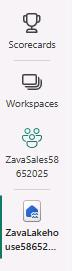

    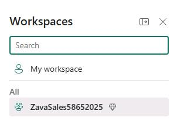

1. In the list of resources on the workspace page, select **LitwareData@lab.LabInstance.Id**.

1. On the lakehouse page, in the **Explorer** pane, hover your cursor over the **Files** node and then select the ellipses (**...**). 
 
    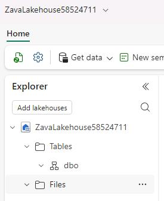

1. Select **New shortcut**.

	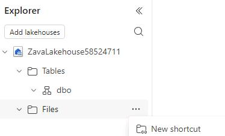

	{: .warning }
    > Fabric allows you to create shortcuts for other resources including tables. Be sure to add the shortcut to the **Files** node.

1. In the **New shortcut** dialog, in the **External sources** section, select **Azure Data Lake Storage Gen2**.
	
    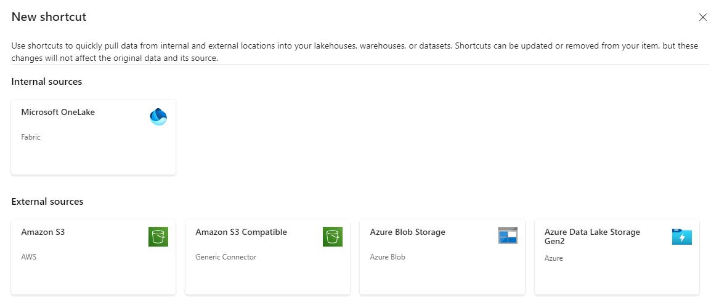
	
1. In the **New shortcut** dialog, select **New connection**.

    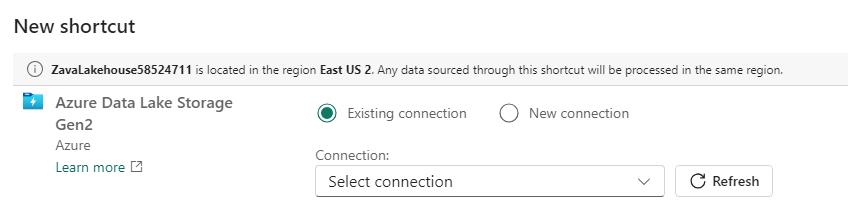

1. In the **Authentication kind** field, select **Account key**.

    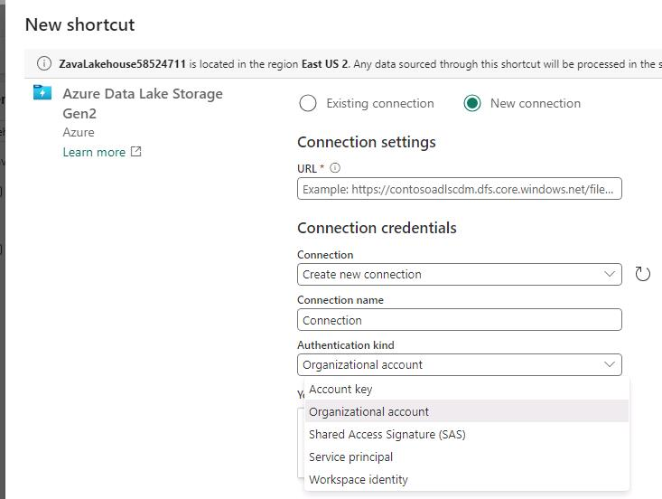

1. Enter connection details by using the values in the following table. Leave all other settings at their default values. 

   **TBC  - Below value to be adjusted**

	| Setting | Value |
    |:---------|:---------|
    | URL   | `https://litwareuc@lab.LabInstance.Id.dfs.core.windows.net/`   |
    | Authentication kind   | **Account Key**   |
    | Account key   | `@lab.Variable(LitWareDataAccessKey)`   |

	{: .note }
    > This is the storage account key that saved to a text field earlier in the instructions when you created the storage account for Litware data.

1. Select **Next**.

   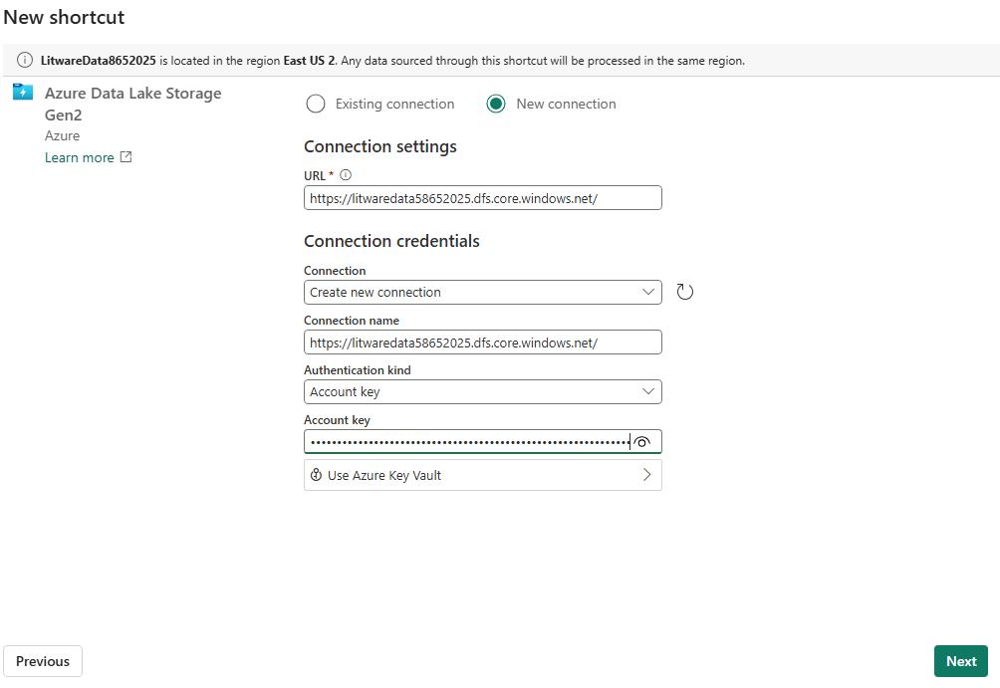

1. Expand **litwaredata** so that you can see the **data**, **litwaredata** and **Products** folders.

    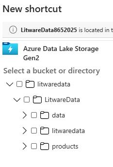

1. Select the **data**, **litwaredata** and **Products** folders and then select **Next**.

    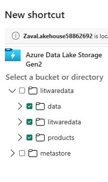

1. Select **Skip**.
	
    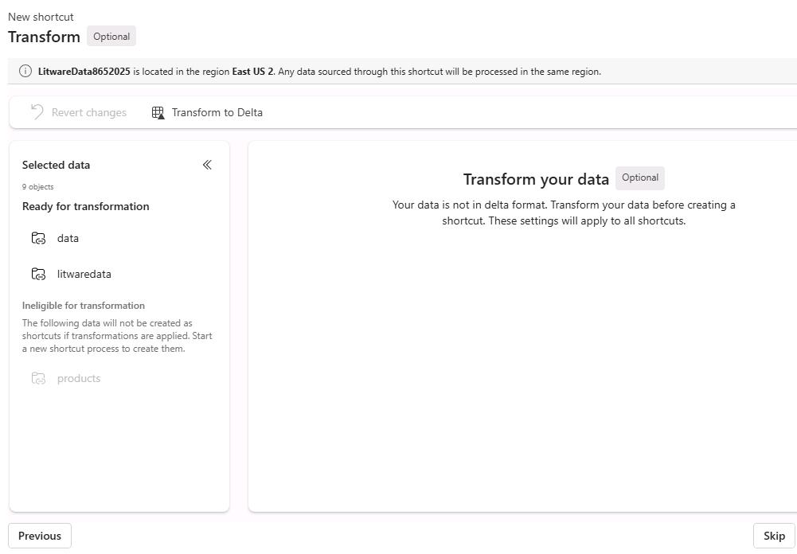

1. Select **Create**.

    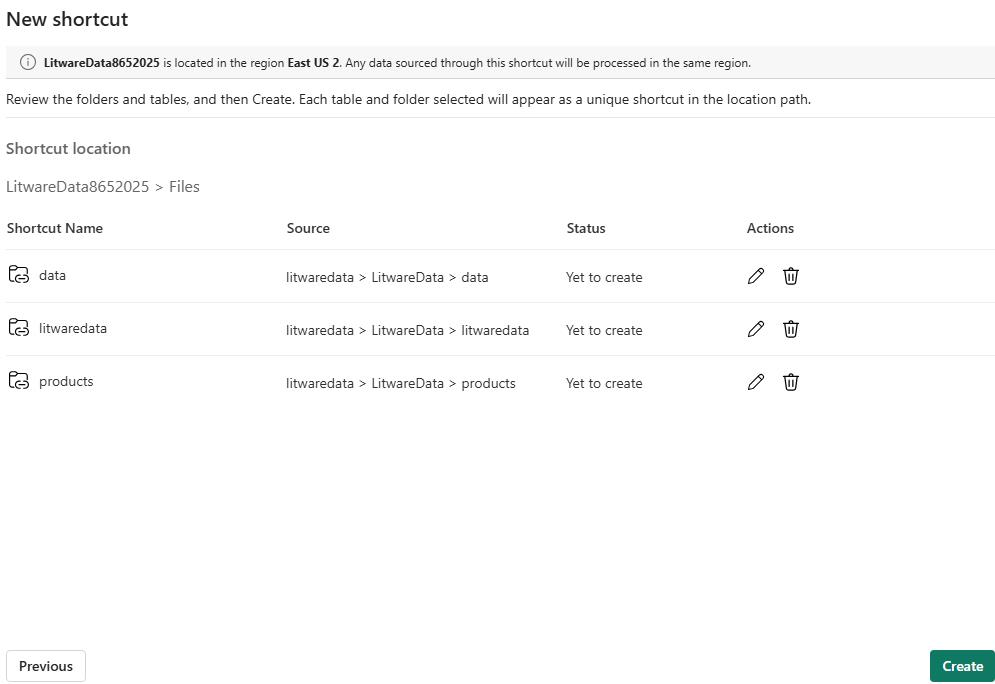

1. In the lakehouse **Explorer** pane, verify that the **data**, **litwaredata** and **Products** folders  are listed.

    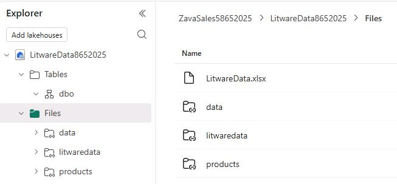

1. Leave the Fabric lakehouse page open.