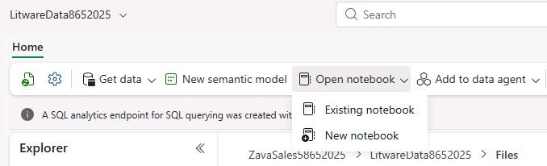
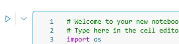
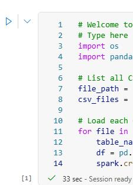
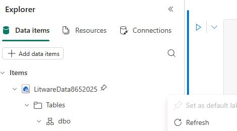
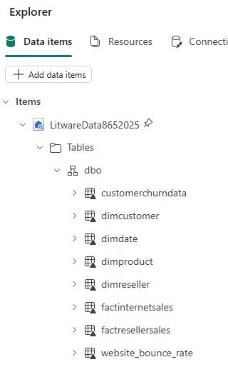
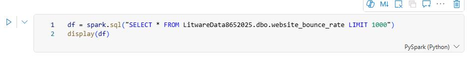
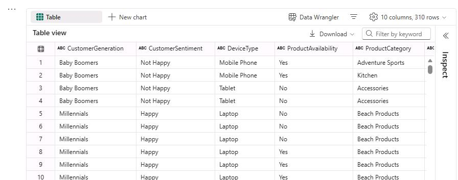

# Task 03: Using data pipelines/data flow for data ingestion

### Introduction
You can use Spark notebooks to create delta tables. This allows you to bring in additional data into OneLake. Using a Spark notebook to create Delta tables helps ensure reliable, scalable, and efficient data management, which is essential for handling big data workflows.


### Key steps

1. On the lakehouse page, on the command bar, select **Open Notebook** and then select **New Notebook**.

	

1. Paste the following code into the existing code cell at line three.

    ```
    import os
    import pandas as pd
    
    # List all CSV files in the 'litwaredata' folder
    file_path = '/lakehouse/default/Files/litwaredata/'
    csv_files = [file for file in os.listdir(file_path) if file.endswith('.csv')]
    
    # Load each CSV file into a table
    for file in csv_files:
        table_name = file.split('.')[0]
        df = pd.read_csv(file_path + file)
        spark.createDataFrame(df).write.mode("ignore").format("delta").saveAsTable(table_name)
    ```

    {: .note }
    > This code creates a reference to the lakehouse folder where the Litware data resides. It then reads the contents of each file and writes the data to a dataframe. Finally, the code writes each dataframe to a delta table.


1. Run the code by selecting **Run cell** (the triangle icon that appears to the left of the code cell).

    

1. Wait for code execution to complete. When complete, you will see a green check mark at left bottom of the cell.

    {: .note }
    > It generally takes 1-3 minutes for code execution to complete.

   

1. In the **Explorer** pane, on the **Data items** tab, expand **Tables** and then expand **dbo**. Select the ellipses (**...**) and then select **Refresh**. 

       

1. Ensure that there are eight tables listed.

    

1. Select the **website_bounce_rate** table.

1. Select **Load data** and then select **Spark**. 

    
    
1. View the code cell that Fabric added and then run the cell.

    

1. Below the code cell, view the bounce rate data. 

    

1. On the command bar, select **Stop session** (the square icon).

1. Leave the Fabric page open.