## Task 01: Create a Delta Live Table pipeline to transform data

<!-- Estimated duration: 15 minutes-->
<!-- Content vetted 1/24/2026 mjc-->

Delta Live Tables (DLT) allow you to build and manage reliable data pipelines that deliver high-quality data in a lakehouse. DLT helps data engineering teams simplify ETL development and management by providing declarative pipeline development, automatic data testing, and deep visibility for monitoring and recovery.

In this task, you will create a DLT pipeline to transform Litware data.


### Key steps

#### 01: Configure the Unity catalog

1. Open Edge and go to [Azure portal homepage](portal.azure.com).

1. If prompted, sign in by using the following credentials:

    | Setting | Value |
    |:---------|:---------|
    | Username   | `@lab.CloudPortalCredential(User1).Username`   |
    | Temporary Access Pass (TAP) token   | `@lab.CloudPortalCredential(User1).AccessToken`   |

1. Search for and then select `Azure Databricks`.

    

1. Select the **dbkwks@lab.LabInstance.Id** Azure Databricks Service resource that was provisioned for you.

    

1. Select **Launch workspace**.

    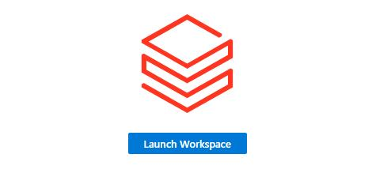

1. On the **Welcome to Databricks** page, in the **Address** field at the top of the page, copy the portion of the URL that from **https://** to **azuredatabricks.net**.

    {: .note }
    > The URL should resemble **https://adb-7405608725412528.8.azuredatabricks.net/**.

1. Paste the value into a notepad for later use.

1. On the **Welcome to Databricks** page, in the left pane, select **Catalog**.

    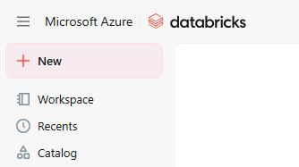

1. On the **Catalog** page, in the list of catalogs, select **dbkwks@lab.LabInstance.Id**.

    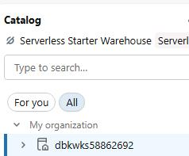

1. On the command bar for the catalog, select **Permissions** and then select **Grant**.

    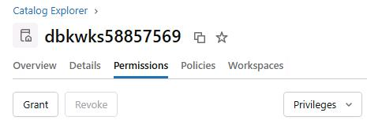

1. In the **Principals** field, select **All account users**.

    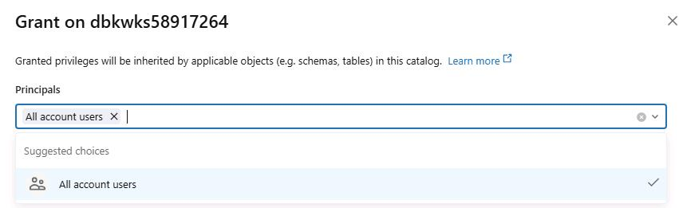

1. At the bottom left of the **Grant...** dialog, select the following privileges and then select **Confirm**:

    - ALL PRIVILEGES
    - EXTERNAL USE SCHEMA
    - MANAGE

    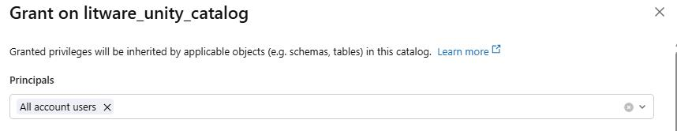
    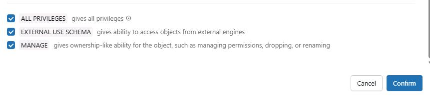

    {: .warning }
    > In a production environment, you would be more selective with regards to the privileges that you grant.

---

#### 02: Create a schema and two volumes

1. On the command bar for the catalog, select **Create schema**.

    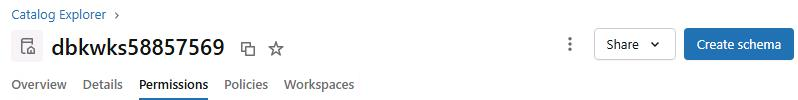

1. In the **Create a new schema** dialog, in the **Schema name** field, enter `schema@lab.LabInstance.Id`.

1. In the **Storage location** section, select **dbkwks@lab.LabInstance.Id**.

    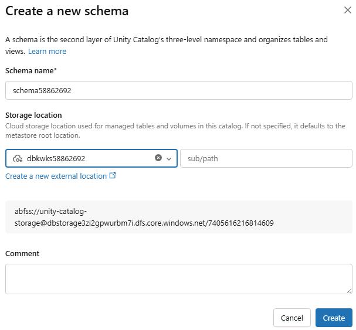

1. Copy the **abfss** location that displays in the dialog. Paste the value into a notepad file.

1. Select **Create**.

1. On the command bar for the schema, select **Create** and then select **Volume**.

    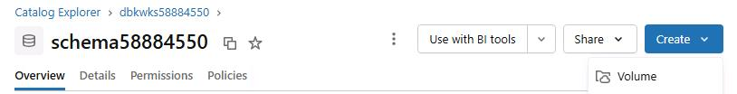

1. In the **Create a new volume** dialog, in the **Volume name** filed, enter the following value and then select **Create**:

    ```
    Volume@lab.LabInstance.Id
    ```

1. In the **Catalog** pane, select **dbkwks@lab.LabInstance.Id** and then select **schema@lab.LabInstance.Id**.

1. On the command bar for the schema, select **Create** and then select **Volume**.

    

1. In the **Create a new volume** dialog, in the **Volume name** filed, enter the following value and then select **Create**:

    ```
    litware_data_extracted
    ```


---

#### 03: Upload data to the Volume@lab.LabInstance.Id volume and extract files

1. In the **Catalog** pane, select the **volume@lab.LabInstance.Id** volume.

1. On the command bar for the volume, select **Upload to this volume**.

    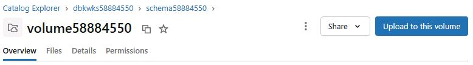

1. In the **Upload files to a Volume in Unity Catalog** dialog, select **browse** and then select **Select files**.

    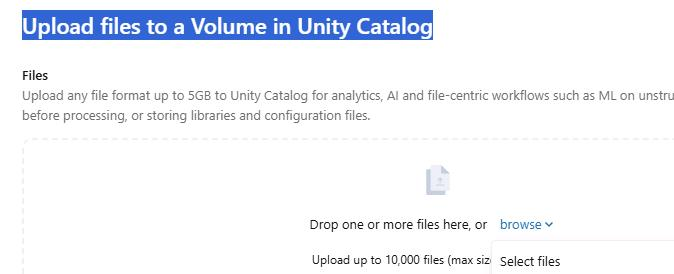

1. In the file **Open** dialog, go to **C:\Lab Assets**. Select the **LitwareData** compressed (zipped) folder and then select **Open**.

    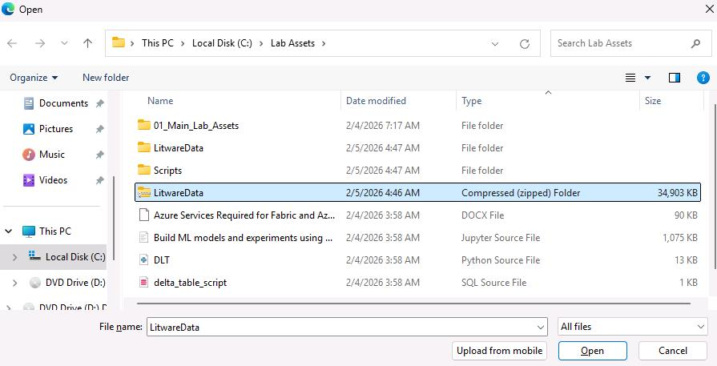

1. In the **Upload files to a Volume in Unity Catalog** dialog, select **Upload**. 

1. Wait for the upload to complete.

    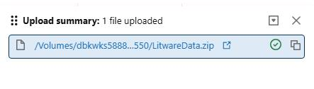


1. In the left pane, select **+ New** and then select **Notebook**.

    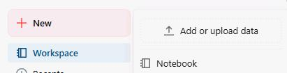

1. In the **Name** field at the top of the page, enter `ExtractFiles` and then select the **Enter** key to save the change.

    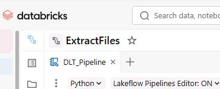

1. Paste the following code into the code cell in the notebook:

    ```
    import zipfile
    import io

    # Create the volume if it doesn't exist
    spark.sql("""CREATE VOLUME IF NOT EXISTS dbkwks@lab.LabInstance.Id.schema@lab.LabInstance.Id.litware_data_extracted""")

    # Read zip file using Spark
    zip_path = "/Volumes/dbkwks@lab.LabInstance.Id/schema@lab.LabInstance.Id/Volume@lab.LabInstance.Id/LitwareData.zip"
    zip_binary = spark.read.format("binaryFile").load(zip_path).collect()[0]
    zip_bytes = zip_binary['content']
    
    # Extract to Volume location
    extract_to = "/Volumes/dbkwks@lab.LabInstance.Id/schema@lab.LabInstance.Id/litware_data_extracted/"
    print("Extracting files to Volume...\n")
    with zipfile.ZipFile(io.BytesIO(zip_bytes)) as z:    
        file_list = z.namelist()    
        print(f"Found {len(file_list)} items in zip\n")        
        for file_name in file_list:        
            if not file_name.endswith('/'):  # Skip directories            
                file_content = z.read(file_name)            
                target_path = f"{extract_to}{file_name}"                        
                # Write using dbutils.fs.put for text files, or create a single-row DataFrame for binary                
                try:                
                    # Try as text first (for CSV, JSON, TXT files)                
                    text_content = file_content.decode('utf-8')                
                    dbutils.fs.put(target_path, text_content, overwrite=True)               
                    print(f"Extracted (text): {file_name}")            
                except UnicodeDecodeError:                
                    # For binary files, write using Spark                
                    from pyspark.sql.types import BinaryType                
                    df = spark.createDataFrame([(file_content,)], ["content"])                
                    df.coalesce(1).write.mode("overwrite").format("binaryFile").save(target_path + "_binary") 
                    print(f"Extracted (binary): {file_name}")
    print(f"\nExtraction complete! Files are in {extract_to}")
    ```

1. On the command bar, select **Run all**.

  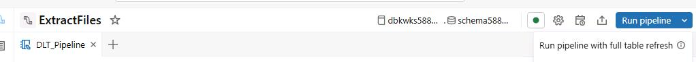


1. Wait for code execution to complete. This process takes 1-2 minutes.

---

#### 04: Upload the pipeline script

1. In the left pane, select **Workspace**.

    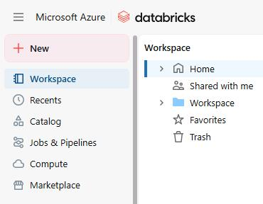

1. In the **Workspace** pane, select **Workspace** and then select **Shared**.

    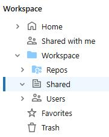

1. On the command bar, select the vertical ellipses (**...**) and then select **Import**.

    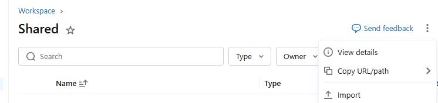

1. In the **Import** dialog, select **browse**.

    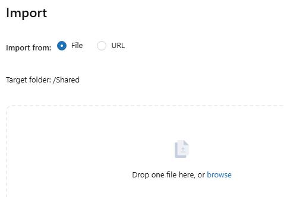

1. Go to **C: \Lab Assets\Scripts**. Select **DLT2_py** and then select **Open**.

    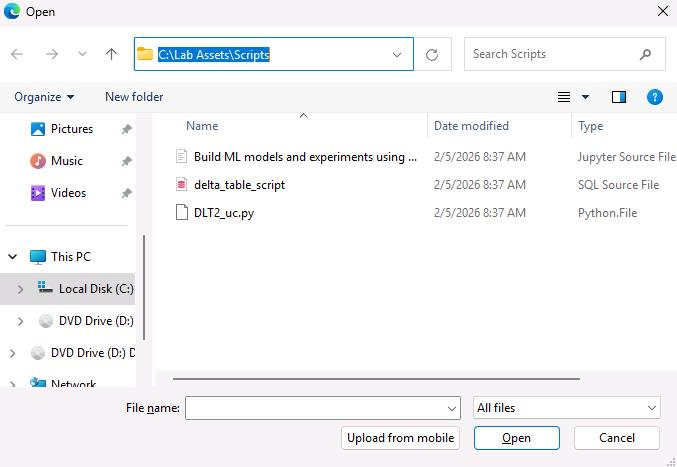


1. Select **Import**.

    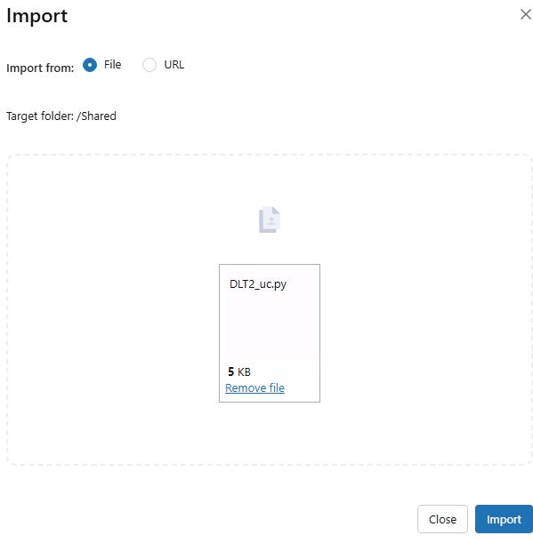

---

#### 05: Set up and run the pipeline

1. In the left pane. select **Jobs & Pipelines**.

  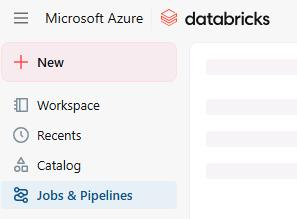

1. In the **Create new** section, select **ETL pipeline**.

   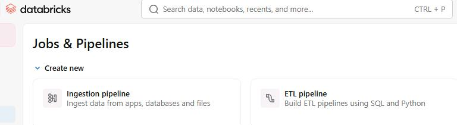 

1. In the **Name** field at the top of the page, enter `DLT_Pipeline` and then select the **Enter** key to save the change.

    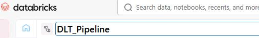

1. Just below the name field, select the current catalog and then select **dbkwks@lab.LabInstance.Id** catalog. 

1. Select the **Schema@lab.LabInstance.Id** schema.

    {: .warning }
    > You may see leftover schemas that have not yet been recycled. Be sure to select your schema (**schemaschema@lab.LabInstance.Id**).


1. On the pipeline page, in the **Advanced options** section, select **Add existing assets**.

    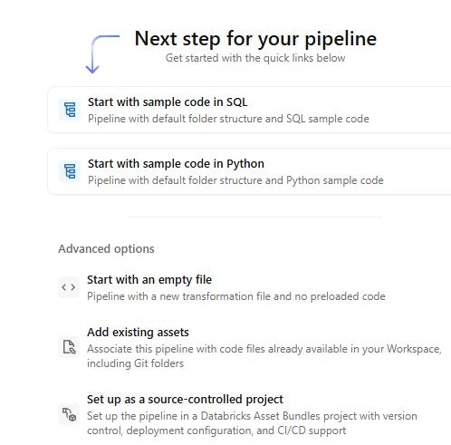

1. In the **Pipeline root folder** field, select **/Workspace/Shared**.

    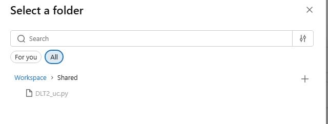

1. In the **Source code paths** field, select the folder icon. 

    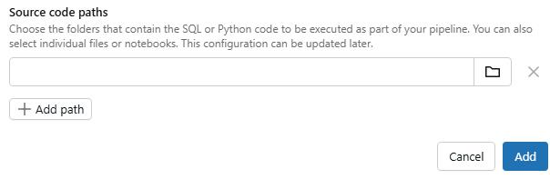 

1. In the **Select a asset** dialog, select **/Workspace/Shared** and then select **DLT2_uc.py**. 

    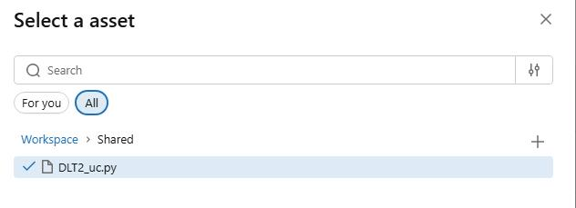

1. Select **Select**.

    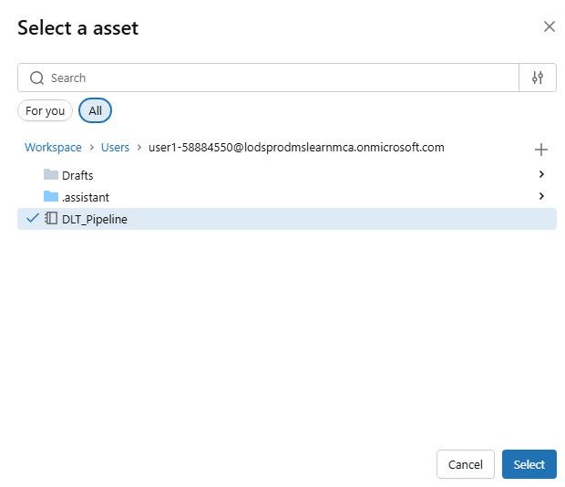

1. Select **Add**.


1. In the **DLT_Pipeline** pane, select **DLT2_uc.py**. The code will open in the center pane.

    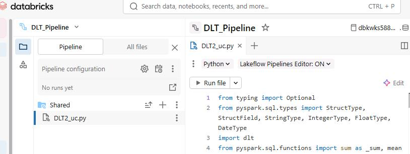

    {: .highlight }
    > On the right command bar, select **Pipeline graph**. This will give you more room in the window to view code.
    >
    > 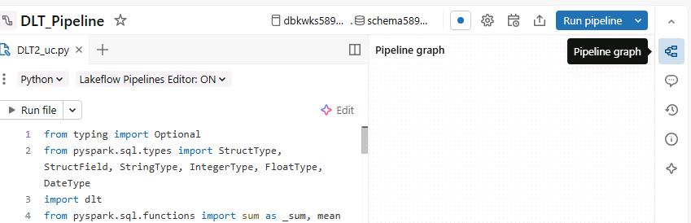

1. On the command bar for the code window, select **Edit**.

    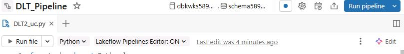

1. Locate the line of code that sets the value for **VOLUME_BASE**.  

    ```
    VOLUME_BASE = "/Volumes/dbkwks58884550/schema58884550/litware_data_extracted/LitwareData/"
    ```

    {: .note }
    > The code should resemble the code segment above and usually appears on or at line 9.

1. Replace the following values in the code with the new values in the table below. This updates the code to use your catalog and schema.

    | Original value | New value |
    |---------|---------|
    | dbkwks58884550   | `dbkwks@lab.LabInstance.Id`  |
    | schema58884550   | `schema@lab.LabInstance.Id`  |

1. On the command bar, select **Settings** (the gear icon). 

    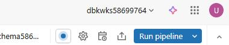

1. Move down to the **Default location for data assets** section and select **Edit catalog and schema**.

    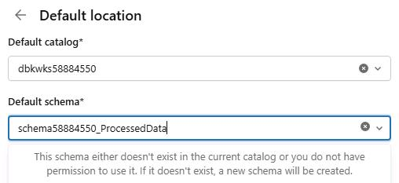

1. In the **Default schema** field, enter `schema@lab.LabInstance.Id_ProcessedData` and then select **Save**.

1. Close the **Pipeline settings** pane.

1. On the command bar, select **Run Pipeline**.

    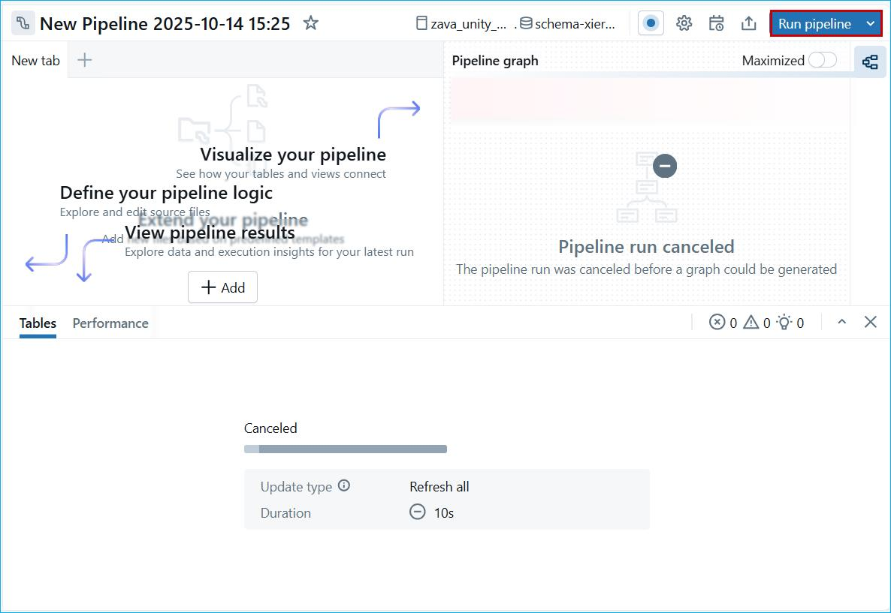

    {: .note }
    > The pipeline can take 2-3 minutes to complete. While the code runs, continue with the remaining steps in this task.

---

#### 06: Create additional tables

1. In the left pane, in the **SQL** group, select **SQL Editor**.

    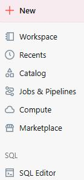

1. In the **Create new** section, select **SQL Query**.

    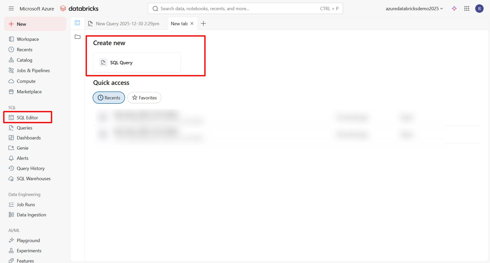

1. Paste following SQL script into the query window:

    ```
    Use catalog dbkwks@lab.LabInstance.Id;
    Use schema schema@lab.LabInstance.Id_processeddata;
    -- Drop existing tables if they exist (optional - remove if you want to preserve existing data)
    DROP TABLE IF EXISTS top_loss_making_campaign;
    DROP TABLE IF EXISTS country_wise_revenue_campaign;
    
    -- Create managed Delta table for top loss making campaigns
    CREATE TABLE top_loss_making_campaign
    USING DELTA
    COMMENT 'Managed Delta table for top loss-making campaigns'
    TBLPROPERTIES ('quality' = 'gold', 'delta.autoOptimize.optimizeWrite' = 'true', 'delta.autoOptimize.autoCompact' = 'true') 
    AS
    SELECT * FROM gold_top_loss_making_campaign;
    
    -- Create managed Delta table for country-wise revenue campaign
    CREATE TABLE country_wise_revenue_campaign 
    USING DELTA
    COMMENT 'Managed Delta table for aggregated campaign data by country'
    TBLPROPERTIES ('quality' = 'gold', 'delta.autoOptimize.optimizeWrite' = 'true', 'delta.autoOptimize.autoCompact' = 'true')
    AS 
    SELECT * FROM gold_country_wise_revenue;
    ```

1. In the query window, on the command bar, select the **dbkwks@lab.LabInstance.Id** catalog and the **Schema@lab.LabInstance.Id_processeddata** schema.

    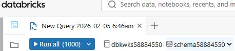

1. Select **Run all**.

    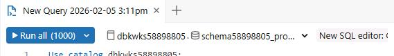

1. []On the confirmation page, select **Start, attach, and run**.

    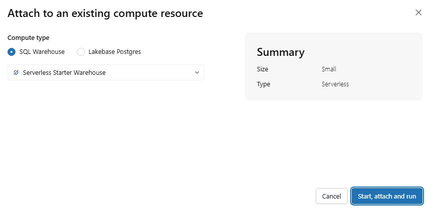
