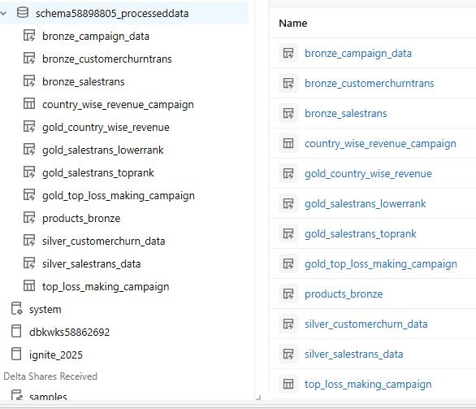
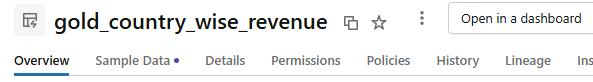
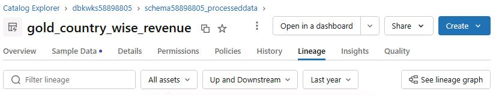
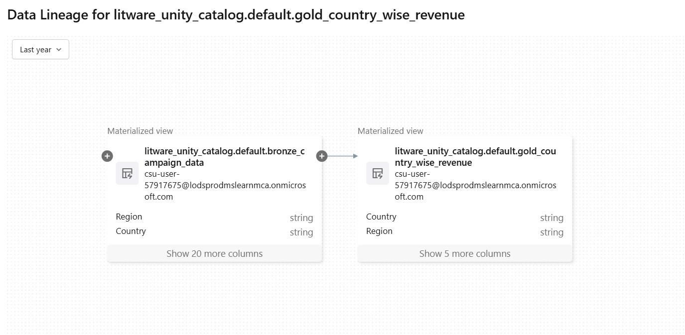
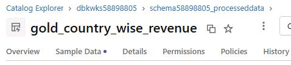
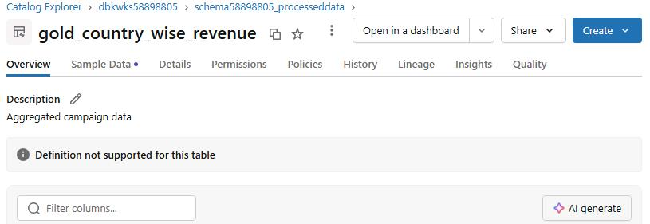
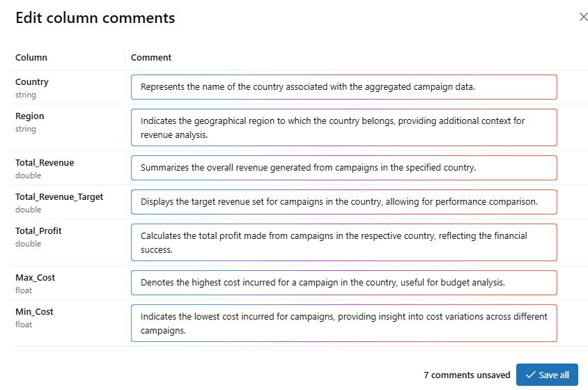

## Task 02: Explore the data in the Azure Databricks environment with Unity Catalog 

### Introduction
In Task 1, you saw how Zava uses DLT pipelines to create a Medallion architecture for their data. Now let's look at how Zava manages data governance by using Unity Catalog.

### Key steps

1. In the left pane, select **Catalog**. 

1. In the list of catalogs, expand **dbkwks@lab.LabInstance.Id**. Then, expand **schema@lab.LabInstance.Id_processeddata**.

1. Verify that there are tables created by the pipeline are listed. Refresh the page if you don't see the tables.

  

1. Select **gold_country_wise_revenue**. 

1. On the command bar for the table, select **Lineage**.

    

1. Select **See lineage graph** to view the full upstream and downstream data flow.

    

    {: .note }
    > View the visualization that shows how the Gold table is derived from upstream Bronze and Silver tables.

    

1. Close the lineage graph page. Then, on the command bar for the table, select **Overview**.

    

1. On the **Overview** tab, select **AI generate** to automatically create column descriptions by using Azure Databricks data intelligence.

    

1. Review the descriptions that the system generated and then select **Save all**.

    