## Task 03: Create a Mirrored Azure Databricks Catalog in Fabric and analyze data by using Transact-SQL

<!-- Estimated duration: 15 minutes-->
<!-- Content vetted 1/24/2026 mjc-->
### Introduction
Mirroring the Azure Databricks Catalog structure in Fabric allows seamless access to the underlying catalog data by using shortcuts. This means that any changes made to the data are instantly reflected in Fabric, without the need for data movement or replication. Eva is Zava's data engineer. 

In this task, let's step into Eva's shoes to create a Mirrored Azure Databricks catalog and analyze the data by using Transact-SQL. 

### Key steps

#### 01: Create a secret scope for Databricks

Create a Delta Live Table pipeline to transform data

1. Open a browser tab and go to `@lab.Variable(DatabricksWorkspaceURL)#secrets/createScope`.

1. Configure the **Create Secret Scope** page by using the following values and then select **Create**.

    | Field | Value |
    |---------|---------|
    | Scope name   | `service-account-scope`   |
    | Manage Principal   | **All workspace users**   |
    | DNS Name   | `@lab.Variable(KeyVaultURI)`    |
    | Resource ID   | `@lab.Variable(KeyVaultResourceID)`   |

    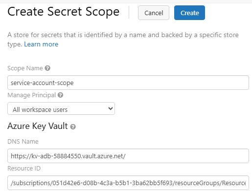

1. In the confirmation dialog, select **OK**.

    

---

#### 02: Create the mirrored catalog

1. Return to the browser tab that displays the Fabric website or go to `https://app.powerbi.com/`.

1. If prompted, sign in by using the following credentials:

    | Setting | Value |
    |:---------|:---------|
    | Username   | `@lab.CloudPortalCredential(User1).Username`   |
    | Temporary Access Pass (TAP) token   | `@lab.CloudPortalCredential(User1).AccessToken`   |

1. In the left pane, select **Workspaces** and then select the **Zava@lab.LabInstance.Id** workspace.

1. On the workspace page, on the command bar, select **New item**.

    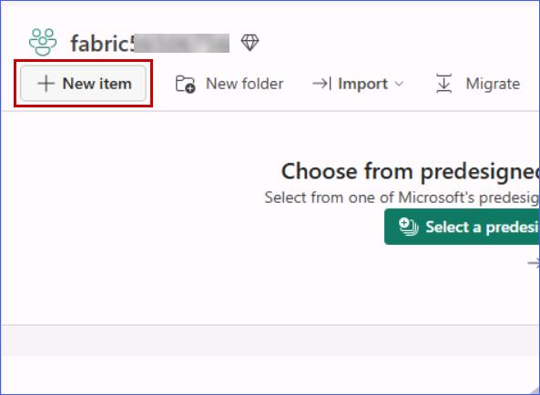

1. In the **New item** dialog, search for `Mirrored Azure Databricks catalog`.

1. In the list of search results, select **Mirrored Azure Databricks catalog**.

    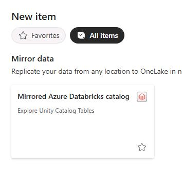

    {: .note }
    > This page can be slow to load. 

1. On the **New source** page, select **New connection**.

    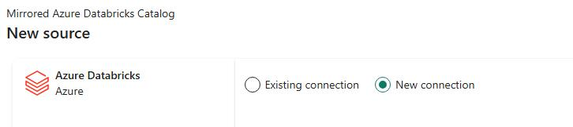

1. In the **URL** field, enter `@lab.Variable(DatabricksWorkspaceURL)`.

1. In the **Authentication kind** field, select **Organizational account** 

1. Sign in by using the following credentials:

    | Setting | Value |
    |:---------|:---------|
    | Username   | `@lab.CloudPortalCredential(User1).Username`   |
    | Temporary Access Pass (TAP) token   | `@lab.CloudPortalCredential(User1).AccessToken`   |

1. Select **Connect**.

    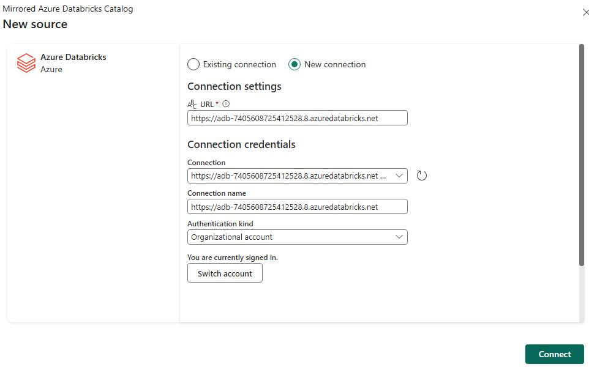

1. Select **Next**.

    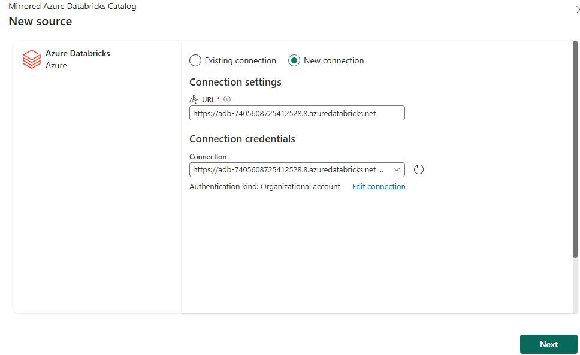

1. On the **Choose data** page, in the **Catalog name** field, select **dbkwks@lab.LabInstance.Id**.

    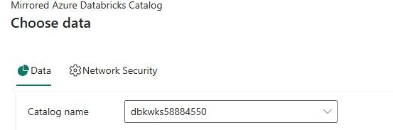

    {: .warning }
    > During development and testing for this workshop, on occasion the catalog does not appear in the **Catalog name** field.
    > The issue appears to be related to propagation of information from Azure Databricks to Fabric. 
    >
    > If the issue occurs, close the dialog and then restart Task 03.

1. Select **schema@lab.LabInstance.Id_processeddata**. Clear the checkboxes for all other schemas. Select **Next**.

    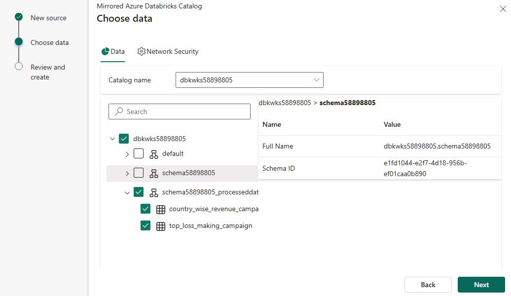

1. If you see a dialog that shows the **Automatically sync future catalog changes for the selected schema** option, select the option and then select **Next**.

    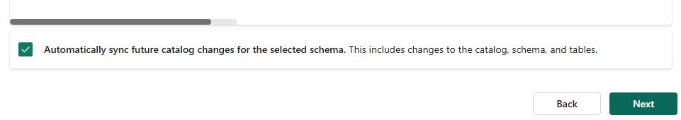

1. Select **Create**.

    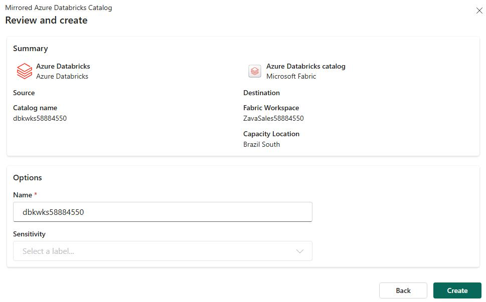

    {: .warning }
    > Do not proceed to the next step until the **Shortcuts created** message displays The message will display at the top right of the page..

    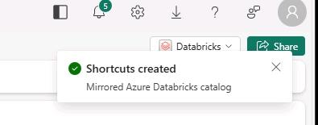

    {: .note }
    > You can monitor the process. On the command bar, select **Monitor catalog** to track the mirroring status.
    >
    > 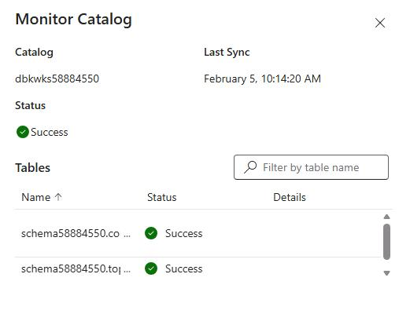

1. You're returned to Fabric. On the **Explorer** pane, select **Refresh**.

1. Expand **schema@lab.LabInstance.Id** and then expand **Tables**. Verify that two tables are listed.

	{: .warning }
    > If you attempt to open the tables from within Fabric to see the data, the operation will fail. In this lab environment, we have not enabled the permissions that allow you to view the data here. You can view the data from within Databricks.

    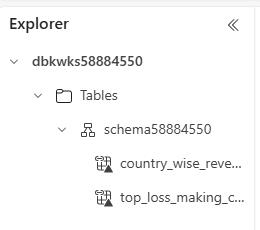