## Task 01: Create and enhance a data agent

### Introduction
Serena believes that generative AI offers a transformative way to interact with data, significantly boosting data-driven decision-making in organizations worldwide. Fabric Data Agents, a new capability in Fabric, allows data analysts like Serena to create their own generative AI experiences.  

In this exercise, create a conversational data agent. 


### Key steps

#### 01: Create the agent

1. Open Microsoft Edge and go to `https://app.powerbi.com/`.

1. If prompted, sign in by using the following credentials:

    | Setting | Value |
    |:---------|:---------|
    | Username   | `@lab.CloudPortalCredential(User1).Username`   |
    | Temporary Access Pass (TAP) token   | `@lab.CloudPortalCredential(User1).AccessToken`   |

1. In the left pane, select **Workspaces** and then select **ZavaSales@lab.LabInstance.Id**.

    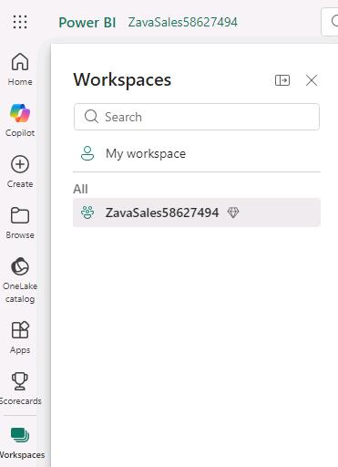

1. On the command bar, select **+ New item**.

    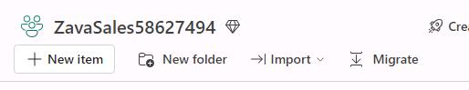

1. In the **New item** pane, search for `Data agent`. Then, in the list of search results, select **Data agent (preview)**.

    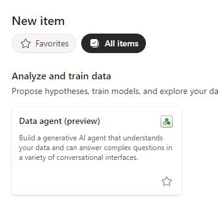

1. In the **Create Data agent** name field, enter `Zava-Assistant@lab.LabInstance.Id` and then select **Create**.

    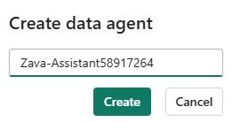

1. In the **Explorer** pane, select **+ Add Data** and then select **Data source**.

    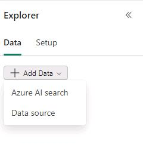

1. In the list of data sources, select **Zavalakehouse@lab.LabInstance.Id** and then select **Add**. Wait while Fabric establishes a connection with the lakehouse.

    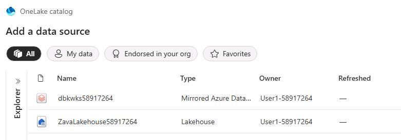

1. On the menu bar for the data agent, select **Refresh** and then expand **dbo**.

1. Select all tables:

    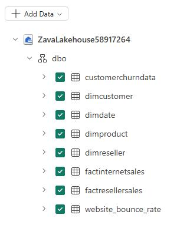

1. Submit the following prompt:

    ```
    What is the most sold product?
    ``` 

    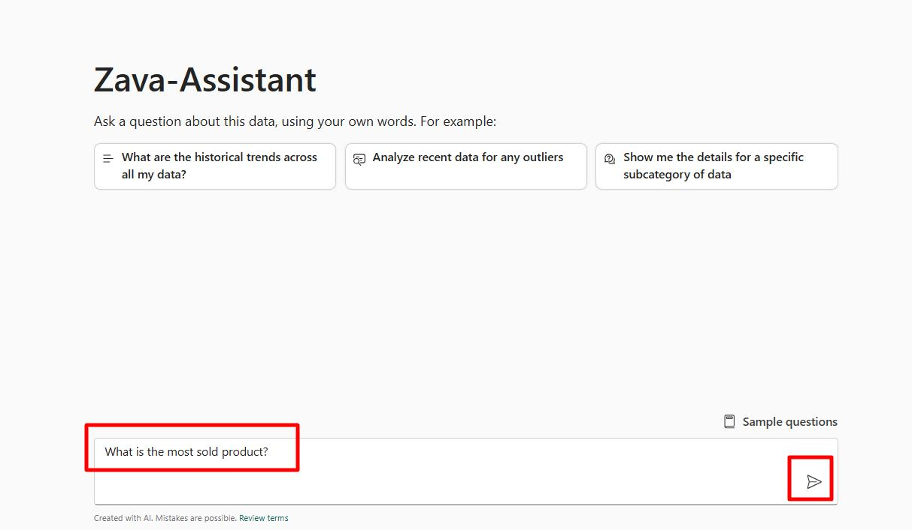

1. In the response, select the drop-down arrow to review the SQL query that was used to derive the response. 

    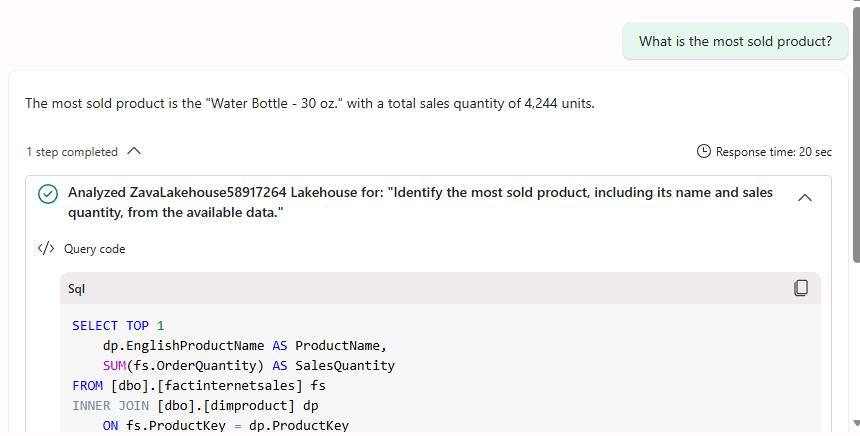

    {: .warning }
    > It may take a minute or two before you see a response. Refresh the browser page if the data agent does not respond as expected.

---

#### 02: Add instructions for the agent
The agent answered the question fairly well based on the selected tables. However, the SQL query needs some improvement. 

Results may be sorted by order quantity even though total sales revenue associated with the product is the most important consideration.

To improve the query generation, you'll provide some instructions to the agent.

1. In the **Explorer** pane, select the **Setup** tab.

    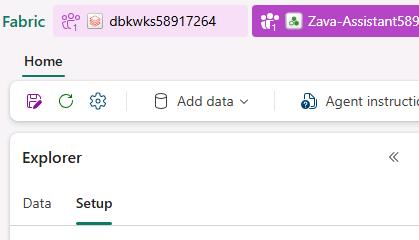

1. In the **Zavalakehouse@lab.LabInstance.Id** section, select **Data source instructions**.

    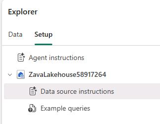

1. In the **Data source instructions** field, enter the following instructions:

    ```
    Whenever I ask about "the most sold" products or items, the metric of interest is total sales revenue and not order quantity.

    The primary table to use is FactInternetSales. Only use FactResellerSales if explicitly asked about resales or when asked about total sales.
    ```

    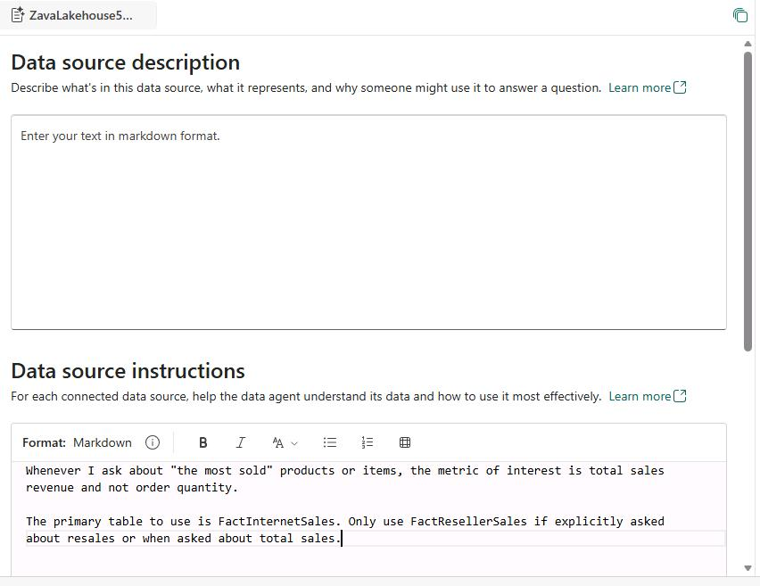


---
#### 03: Add example queries
In addition to instructions, examples serve as another effective way to guide the AI. You can add examples that represent questions that the data agent often receives, or questions that require complex joins.

1. In the **Explorer** pane, select the **Setup** tab.

1. In the **Zavalakehouse** section, select **Example queries**.

    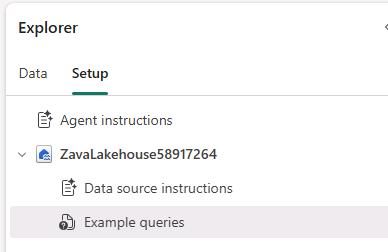

1. Select **+ Add example** and enter the following question and SQL query.

    {: .warning }
    > Fabric validates each of the queries after you paste the query into the field. The process for validating the three queries may take a couple of minutes. 
    >
    > Fabric will alert you if a query has errors. You must fix (or delete) any queries that cause errors.

    |Question| SQL query|
    |--------|----------|
    |```What is the most sold product?```|```SELECT TOP 1 dp.EnglishProductName AS MostSoldProduct FROM dbo.dimproduct dp JOIN dbo.factinternetsales fis ON dp.ProductKey = fis.ProductKey JOIN dbo.factresellersales frs ON dp.ProductKey = frs.ProductKey GROUP BY dp.EnglishProductName ORDER BY SUM(fis.SalesAmount) DESC;```|

    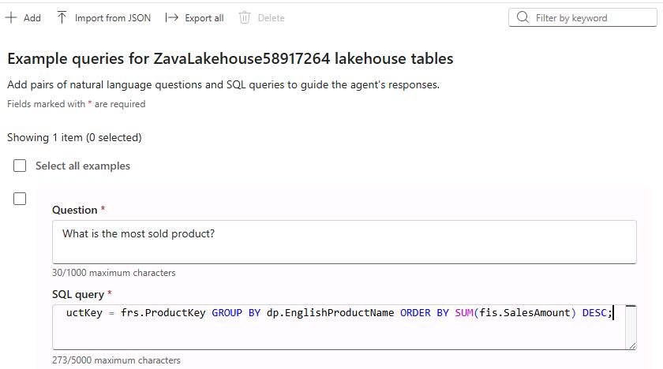

1. Repeat the process to add the following questions and queries.

    {: .highlight }
    > On the command bar, use **+ Add** to add the additional questions and queries.

    |Question| SQL query|
    |--------|----------|
    |```who are the top 5 customers by total sales amount?```|```SELECT TOP 5 CONCAT(dc.FirstName, ' ', dc.LastName) AS CustomerName, SUM(fis.SalesAmount) AS TotalSpent FROM factinternetsales fis JOIN dimcustomer dc ON fis.CustomerKey = dc.CustomerKey GROUP BY CONCAT(dc.FirstName, ' ', dc.LastName) ORDER BY TotalSpent DESC```|
    |```what is the total sales amount by year?```|```SELECT dd.CalendarYear, SUM(fis.SalesAmount) AS TotalSales FROM factinternetsales fis JOIN dimdate dd ON fis.OrderDateKey = dd.DateKey GROUP BY dd.CalendarYear ORDER BY dd.CalendarYear```|

    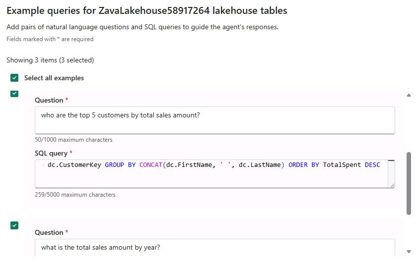

1. Select **Close(X)** (the **X**).

    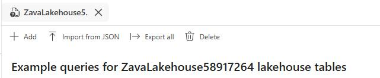

1. Return to the agent **Test the agent's responses** tab and select **Clear chat**.

    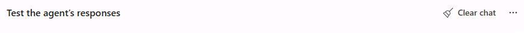

1. Submit the following prompt:

    ```
    What is the most sold product?
    ```

    {: .note }
    > Asking the question now returns a different answer, **Mountain-200 Black, 38**, as shown in the below screenshot:
    >
    > 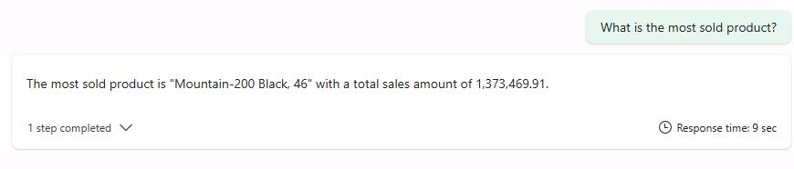

1. Submit the following prompt:
    
    ```
    Who are the top 5 customers by total sales amount?
    ``` 

    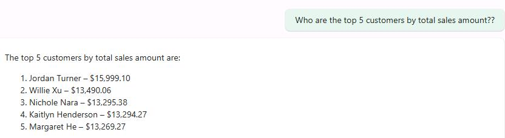

1. On the command bar for the agent, select **Publish**.

    

1. In the **Publish data agent** dialog, select **Publish**.

    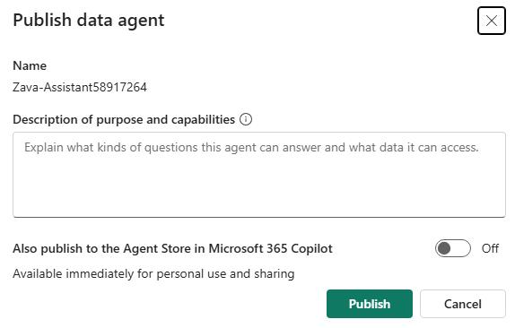

1. After the **Successfully published data agent** message displays, select **View publishing details**.

    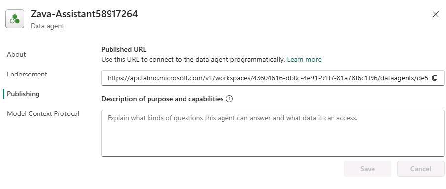

    {: .note }
    > If the dialog confirming that publication is complete is no longer visible, on the command bar for the agent, select **Settings** (the gear icon) to view the same information.

1. Review the value in the **Published URL** field. The URL contains some important information that you need to copy.

    - **workspaces**: This is the unique workspace ID. Copy the unique identifier to the following text field:
        @lab.TextBox(FabricDataAgentWorkspaceID)
    - **dataagents**: This is the unique artifact ID. Copy the unique identifier to the following text field:
        @lab.TextBox(FabricDataAgentArtifactID)

    {: .note }
    > In the following example URL, **43604616-db0c-4e91-91f7-81a78f6c1f96** is the workspace ID and **de592c0f-a3f3-4618-af9c-bcd04bc4140a** is the artifact ID.
    >
    > https://api.fabric.microsoft.com/v1/workspaces/**43604616-db0c-4e91-91f7-81a78f6c1f96**/dataagents/**de592c0f-a3f3-4618-af9c-bcd04bc4140a**/aiassistant/openai
