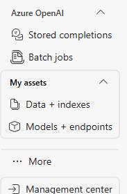
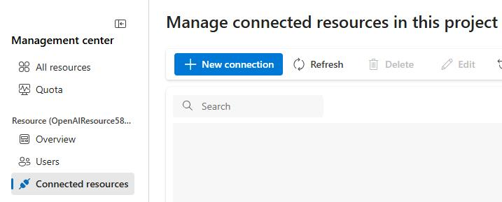
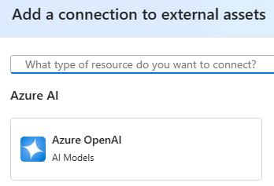
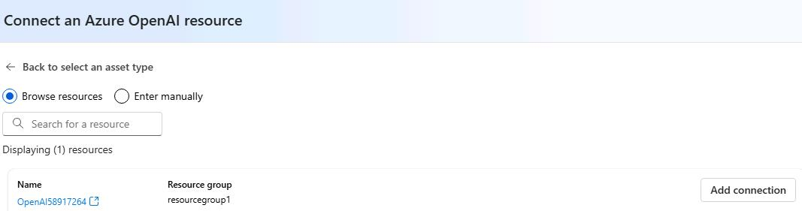
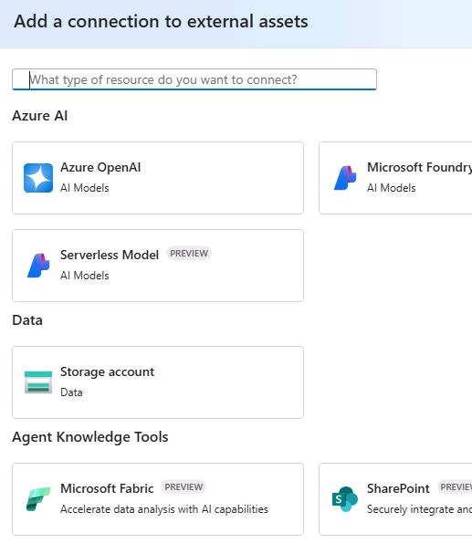
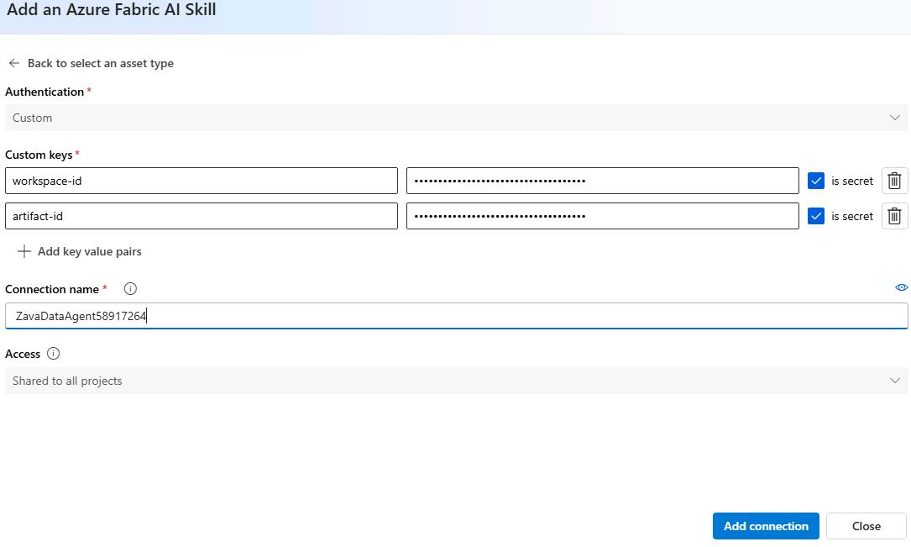
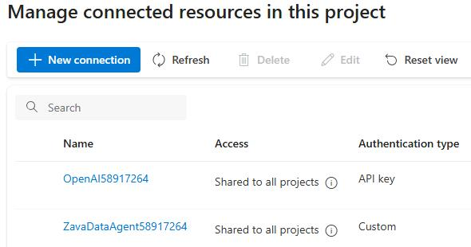

## Task 02: Establish Azure OpenAI and Fabric connections in Microsoft Foundry

### Key tasks

1. Open a new Edge browser tab in your VM browser go to `https://portal.azure.com`.

1. If prompted, sign in by using the following credentials:

    | Setting | Value |
    |:---------|:---------|
    | Username   | `@lab.CloudPortalCredential(User1).Username`   |
    | Temporary Access Pass (TAP) token   | `@lab.CloudPortalCredential(User1).AccessToken`   |

1. In the **Search** field, enter `Resource Groups`. 

    

1. In the list of resource groups, select **ResourceGroup1**.

    

1. In the list of resources, select the **firstproject** project.

    

1. On the page for the project, select **Go to Foundry portal** to launch Microsoft Foundry.

    

1. In Microsoft Foundry, in the left pane, move to the bottom of the list of resources and select **Management center** .

    

1. In **Management center**, in the left pane, select **Connected resources** and then select the **+ New connection** button.

    

1. In the **New connection** pane, select **Azure OpenAI** from the list of connection types. 

    

    {: .note }
    > The dialog will show an OpenAI resource that was provisioned for you. One or more models have already been deployed. 

1. Select **Add connection**.

    

1. Close the dialog.

1. Select **+ New connection**.

1. In the **Add a connection to external assets** dialog, in the **Agent Knowledge Tools** section, select **Microsoft Fabric**. 

    

1. Configure the connection by using the following information:

    | Parameter | Value |
    |:---------|:---------|
    | workspace-id   | `@lab.Variable(FabricDataAgentWorkspaceID)`   |
    | artifact-id   | `@lab.Variable(FabricDataAgentArtifactID)`   |
    | Connection name  | `ZavaDataAgent@lab.LabInstance.Id`   |
    
1. Select **Add connection**.

    

1. Wait until the service copnnects and then select **Close**. You will see both connections listed on the **Connected resources** tab.

    

1. Leave the Microsoft Foundry page open.