## Task 03: Build a Microsoft Foundry agent grounded with Fabric data

### Introduction
In this task, you help Reta create a Microsoft Foundry agent that uses the Fabric Data Agent you created. This agent will be able to answer questions about Zava's customer and sales data by using natural language.

### Key steps

#### 01: Create the agent

1. At the top left of the page, select **Microsoft Foundry** to return to the Foundry home page.

    

1. In the list of projects, select **first project**.

    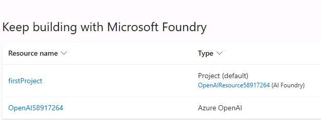

1. In the left pane, in the **Build and customize** section, select **Agents**.

    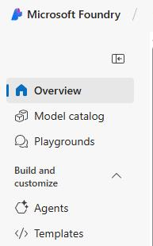

1. In the **Deploy a model** dialog, select **gpt-4.1** and then select **Confirm**. 

    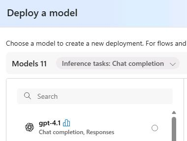

1. In the **Deploy gpt-4.1** dialog, select **Deploy**.


1. Select the newly created agent and then select **Try in playground**.

    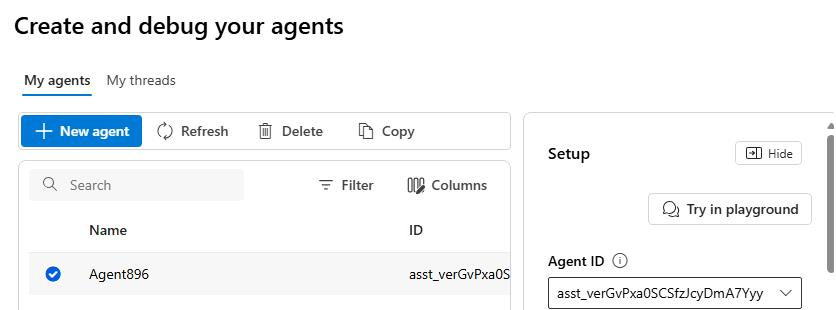

1. Configure the fields in the **Setup** pane by using the following information:

    | Field | Value |
    |:---------|:---------|
    | Agent name   | `ZavaInsightsAgent@lab.LabInstance.Id`   |
    | Instructions   | `You are an AI assistant that helps Zava to gain insights from customer churn and sales data. Use the Fabric Data Agent to answer questions about customer behavior and sales trends. Provide clear and concise answers with relevant details.`   |
    | Deployment   | **gpt-4o**   |


    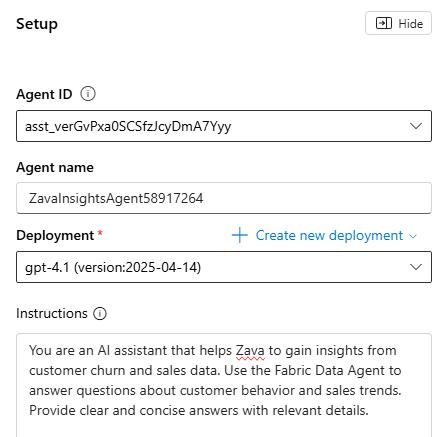

---

#### 02: Ground the agent with data from Fabric

1. On the **Setup** pane, in the **Knowledge (0)** section, select **+ Add**.

    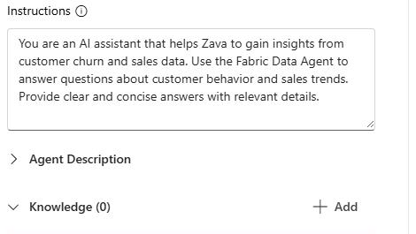

1. In the **Add knowledge** dialog, in the list of knowledge types, select **Microsoft Fabric** . 

    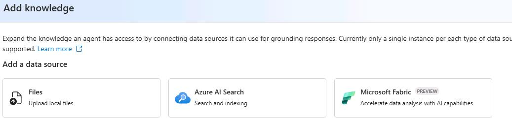

1. Select the **ZavaDataAgent@lab.LabInstance.Id** connection  and then select **Connect**.

    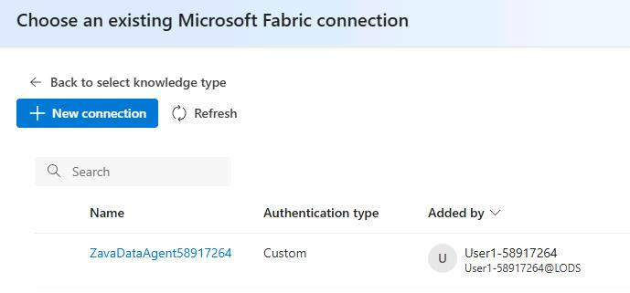

---

#### 03: Configure tools

1. On the **Setup** pane, move down to the **Actions (0)** section and then select **+ Add**.

    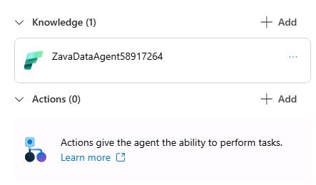

1. In the **Add action** dialog, select **Code Interpreter**.

    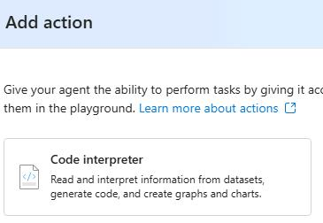

1. In the **Add code interpreter action** dialog, select **Save**.

    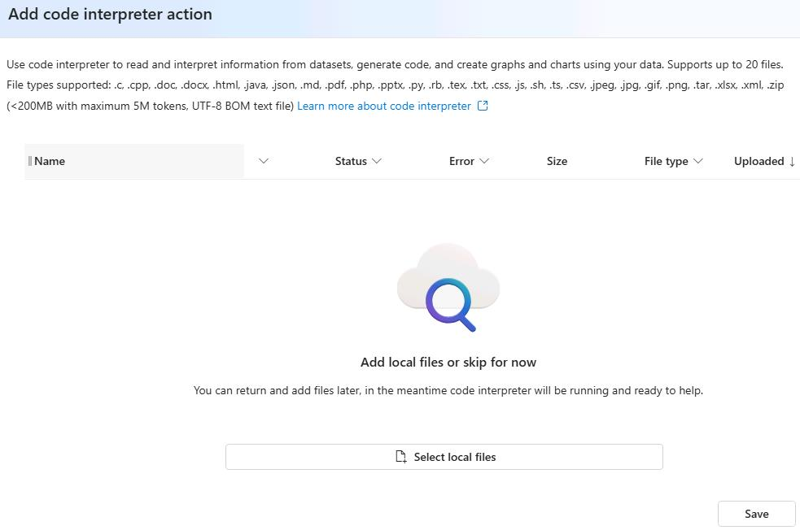

1. Submit the following prompt. The agent will use the Fabric Data Agent to fetch the relevant data and provide an answer to your question.

    ```
    What are the top 5 selling products by total revenue?
    ```

    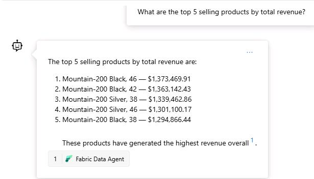

    {: .warning }
    > It may take the agent a few moments to respond as it fetches data from the Fabric data agent. 

1. Submit the following prompt. The agent will use the Code Interpreter tool to generate a bar chart of the top five selling products by total revenue.

    ```
    Can you show me a bar chart of the top 5 selling products by total revenue?
    ```

    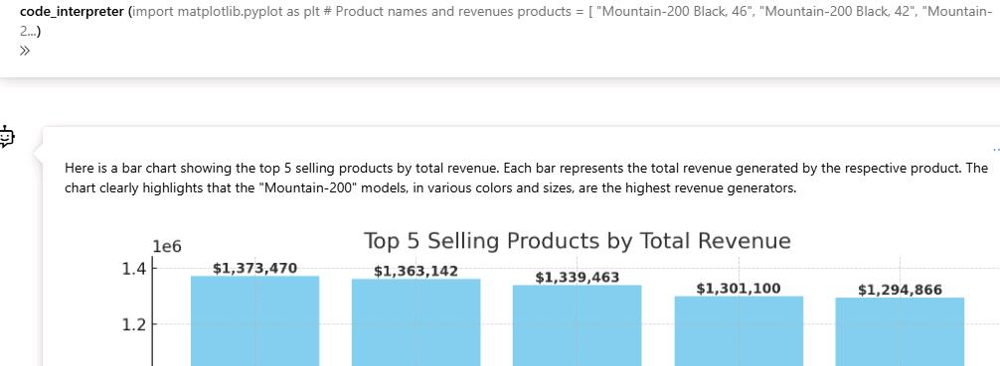
