## Task 01: Create a Semantic model and generate insights by using Copilot for Power BI

### Introduction
Based on all the gathered data, Wendy is expected to create Power BI reports for other data citizens and stakeholders. Let's step into her shoes to experience the power of Copilot for Power BI in conjunction with Direct Lake Mode.

### Key steps

1. Open Microsoft Edge and go to [Power BI](https://app.powerbi.com/).

1. If prompted, sign in.

1. Select **Workspaces** and then select **ZavaSales@lab.LabInstance.Id**.

1. Select the lakehouse.

1. On the command bar, select **New semantic model**. 

   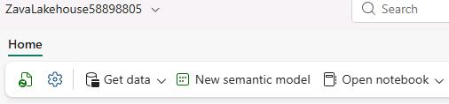

1. In the **New semantic model** dialog, enter 

    ```
    website_bounce_rate_model@lab.LabInstance.Id
    ``` 


1. In the **Tables** section, locate and select the **website_bounce_rate** and then select **Confirm**.

    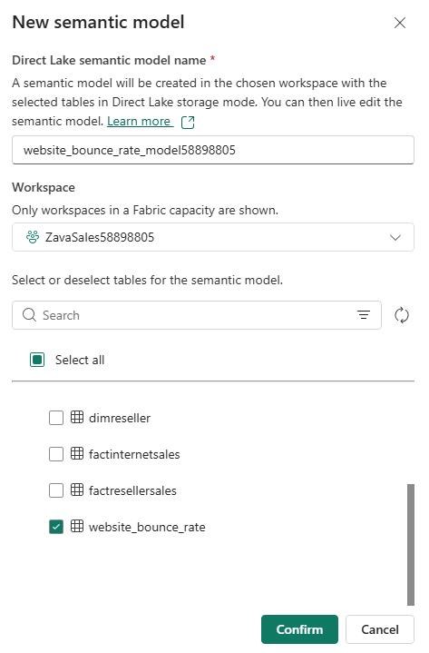

1. Wait for the system to create the semantic model. This process may take a couple of minutes.

1. On the command bar, select **Settings** (the gear icon) and then select **Power BI settings**.

    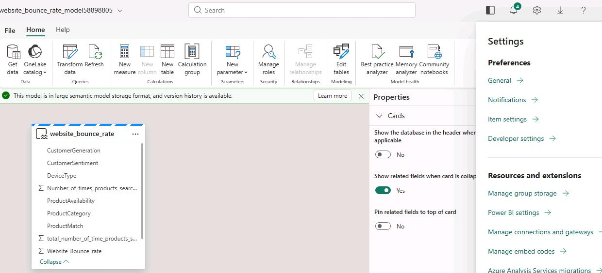

    {: .note }
    > If the settings icon is not visible, select the ellipses (**...**) next to the **Profile** icon and then select **Settings**.

1. On the command bar, select **Semantic models**. 

    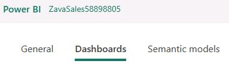
    
1. []In the list of models that displays on the left side of the page, select the **website_bounce_rate_model** model. 

    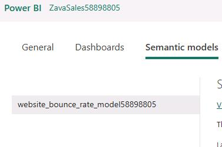

1. Move down the page and select the **Q&A** section.

1. Select **Turn on Q&A to ask natural language questions about your data** and then select **Apply**.

    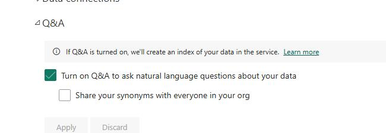

1. In the left pane, select the **Zavasales@lab.LabInstance.Id** workspace. 

    

1. In the list of resources, select the ellipses (**...**) next to the **website_bounce_rate_model**  semantic model and then select **Create report**.

    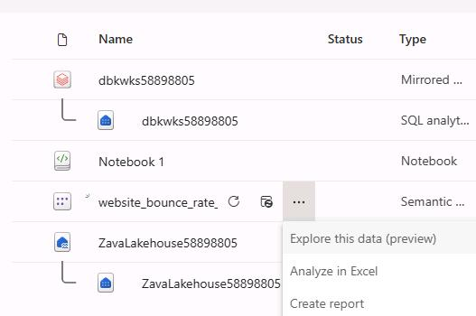

1. On the command bar, select **Copilot**. 

    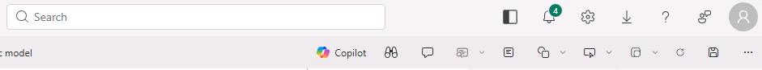

1. In the Copilot pane, toggle the Preview switch on then select **Get Started**.

    

1. Submit the following prompt:

    ```
    What's in my data?
    ```
    
1. Review the response.

    {: .note }
    > 'What's in my data?' provides an overview of the contents of the dataset, identifies and describes what's in it and what the attributes are about. So, there's no need to wait for someone to explain the dataset. This improves the efficiency and volume of report creation.

     

1. Submit the following prompt:

    ```
    Create a detailed page to analyze the Website Bounce Rate.
    ``` 

    {: .note }
    > If you see the error message saying, 'Something went wrong.', try refreshing the page and restarting the task. 
    >
    > Your results will likely differ from the screenshot below.   

  
    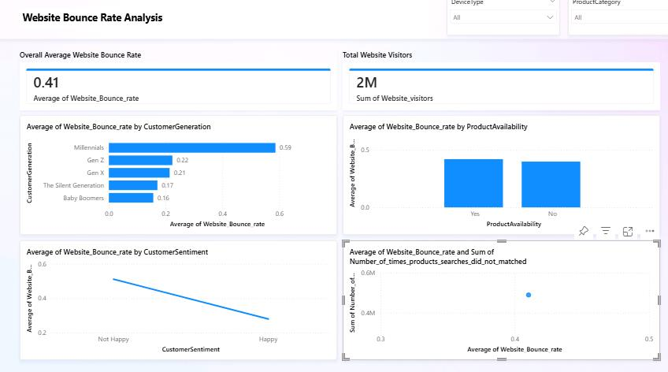
	
1. Review the response.

    {: .note }
    > The report shows that the website bounce rate for Zava is especially high amongst the Millennial customer segment.  

1. Submit the following prompt:

    ```
    Based on the data in the page, what can be done to improve the bounce rate of millennials?
    ```

1. Copilot creates the desired Power BI report and even goes a step further to give powerful insights. 
	
    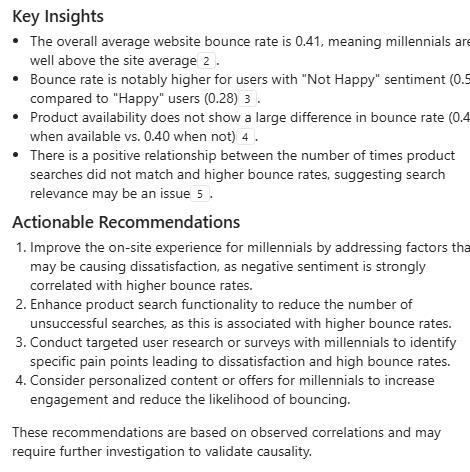

1. In the **Visualizations** pane, select the **Narrative** visual from the **Visualizations** pane it to the report canvas.

    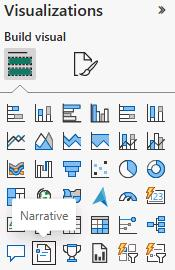

1. Resize visualization to fit the report canvas.
 
1. Within the visualization, select **Copilot (preview)**. 

    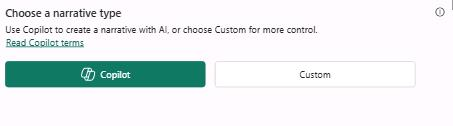
    
1. Submit the following prompt and then select **Update**: 

    ```
    Summarize the data, provide an executive summary, indicating important takeaways.
    ``` 
 
    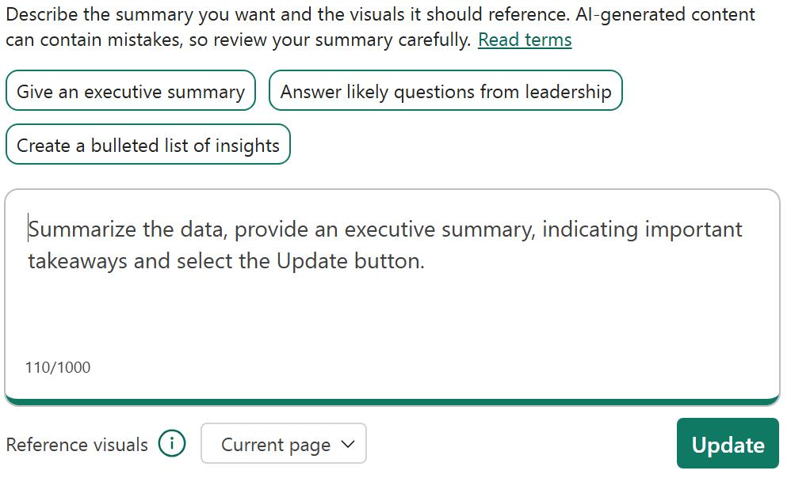

    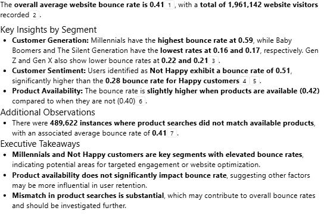
   

1. On the command bar, select **File**. Then, select **Save**.
