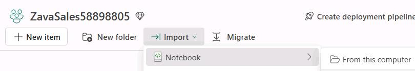
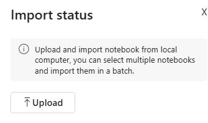
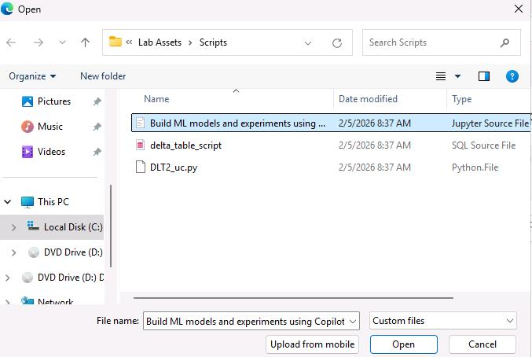
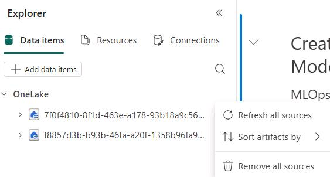
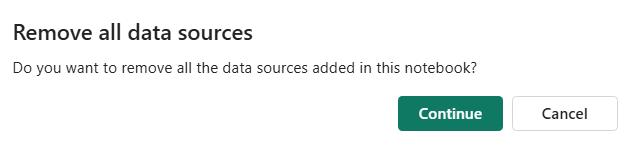
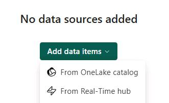
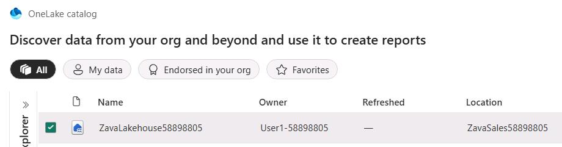
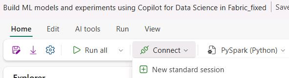
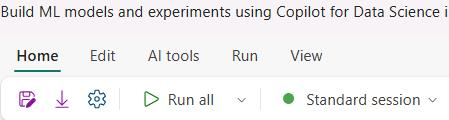

## Task 01: Build machine learning models and experiments by using Copilot in Fabric

### Introduction
To understand the cause behind Zava's declining revenue, the team needed to dive deeper into their customers' spending pattern.

Copilot responds to queries in natural language or generates customized code snippets for tasks like creating charts, filtering data, applying transformations, and building machine learning models.

Let's see how Copilot for Notebook helps you, as a Data Scientist, quickly create Data Science Notebooks.

### Key steps


1. In the left pane, select the **ZavaSales@lab.LabInstance.Id** workspace.

1. Select **Import**, select **Notebook**, and then select **From this computer** to upload a notebook.

    

1. In the **Import status** pane, select **Upload**.

    
    
1. In the File **Open** dialog, go to `C:\Lab Assets\Scripts`. Select **Build ML models and experiments using Copilot for Data Science in Fabric_fixed** notebook.

1. Select **Open**. Wait for the notebook to upload.

    

1. In the **Explorer** pane, next to **Onelake**, select the ellipses (**...**) and then select **Remove all sources**. 

    

1. In the confirmation dialog, select **Continue**.

    


1. Select **Add data items** and then select **From OneLake Catalog**.

    

1. Select the **lakehouse** checkbox and then select **Connect**.

    

1. On the command bar, select **Connect** and then then select **New standard session**.

    

1. In the notebook, move down to locate the **Feature 1: Chat Panel** cell. 

1. Replace the code in the cell with the following code:

    ```
    spark_df = spark.table('ZavaSales@lab.LabInstance.Id.ZavaLakehouse@lab.LabInstance.Id.dbo.customerchurndata')
    df = spark_df.toPandas()
    ```
1. Move down the page to locate the **Step 1: Load customer churn (labeled) data from silver layer Delta tables into Spark DataFrame** code cell. 

1. Replace the code in the cell with the following code:

    ```
    df = spark.sql("SELECT * FROM ZavaSales@lab.LabInstance.Id.ZavaLakehouse@lab.LabInstance.Id.dbo.customerchurndata")
    df.show(6)
    ```
1. On the command bar, select **Run all**. 

    

1. Review the output from each cell.
