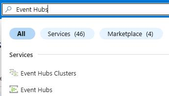
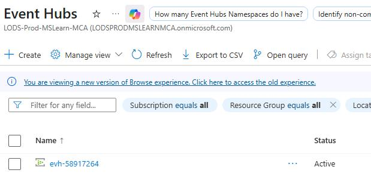
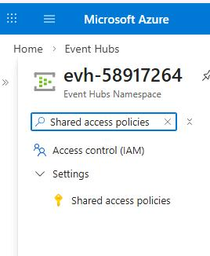
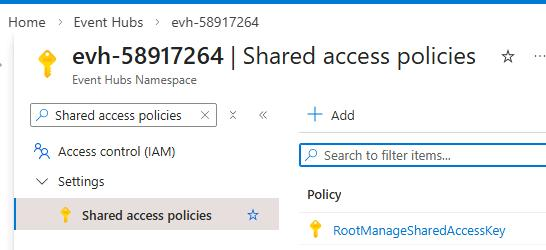
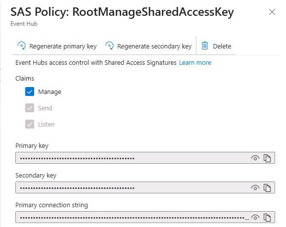
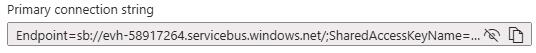
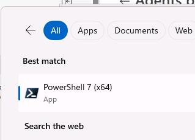
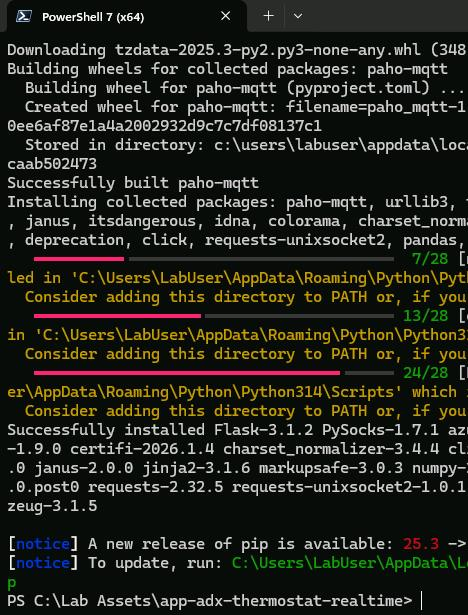
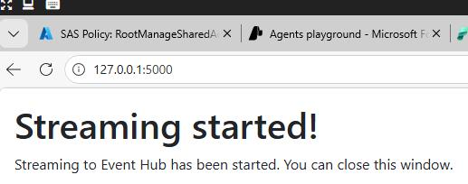

## Task 01: Start the thermostat and occupancy simulator

### Introduction
To simulate real-time data ingestion, you'll start an IoT data simulator that streams telemetry into Azure Event Hubs.

### Description
In this task, you'll retrieve Event Hub credentials and configure a simulator to generate streaming data.

### Example scenario
Operations teams monitor temperature and occupancy data to detect anomalies during high-traffic events.

### Success criteria
Streaming data is successfully sent to Event Hubs.

### Learning resources
*   Event Hubs overview
*   Real-time analytics in Fabric

### Key steps

#### 01: Retrieve the for the Eventhouse resources that was deployed for you


1. Open Edge and go to `portal.azure.com`.

1. If prompted, sign in by using the following credentials:


    | Setting | Value |
    |:---------|:---------|
    | Username   | `@lab.CloudPortalCredential(User1).Username`   |
    | Temporary Access Pass (TAP) token   | `@lab.CloudPortalCredential(User1).AccessToken`   |

1. Search for and then select `Event Hubs`.

    

1. Select the evh-@lab.LabInstance.Id resource.

    

1. In the left pane, search for and select `Shared access policies`.

    

1. In the list of policies, select **RootManageSharedAccessKey**.

    

1. In the **SAS Policy** pane, in the **Primary connection string** field, select **Show content** (the **eye** icon).

    

1. In the **SAS Policy** pane, in the **Primary connection string** field, select **Copy**.

    

1. Paste the connection string into a notepad.


---

#### 02: Configure the simulator

1. In the @lab.VirtualMachine(Win11-Pro-Base).SelectLink virtual machine, on the Windows Task Bar, in the search field, enter `PowerShell`.

    

1. In the list of search results, select **PowerShell 7 (x64)**.

       

1. Run the following command:

    ```
    cd "C:\Lab Assets\app-adx-thermostat-realtime"
    ```

    

    {: .note }
    > This moves you to the folder containing the simulator project.

1. In **File Explorer**, in the address bar, enter `PowerShell`.

1. Run the following command to install required components:

    ```powershell
    python -m pip install --user -r requirements.txt
    ```

    {: .note }
    > It may take 1-3 minutes to complete the process.

    

1. Run the following command:

    ```powershell
    $therm = '{"main_data_frequency_seconds":3,"urlStringEventhub":"@lab.Variable(EventHubCxString)","EventhubName":"thermostat","urlPowerBI":"https://httpbin.org/post","data":[{"BatteryLevel":{"minValue":0,"maxValue":100}},{"Temp":{"minValue":60.0,"maxValue":74.0}},{"Temp_UoM":{"minValue":["F"],"maxValue":["F"]}}] }'

    $occ = '{"main_data_frequency_seconds":3,"urlStringEventhub":"","EventhubName":"occupancy","urlPowerBI":"https://httpbin.org/post","data":[{"BatteryLevel":{"minValue":0,"maxValue":100}},{"visitors_cnt":{"minValue":20,"maxValue":30}},{"visitors_in":{"minValue":0,"maxValue":10}},{"visitors_out":{"minValue":0,"maxValue":10}},{"avg_aisle_time_spent":{"minValue":20,"maxValue":30}},{"avg_dwell_time":{"minValue":3,"maxValue":13}}] }'

    $env:thermostatTelemetryConfig = $therm
    $env:occupancyDataConfig = $occ
    ```

1. Run the following command. This starts the simulator.

    ```powershell
    python app.py
    ```

1. Open Edge and go to `http://127.0.0.1:5000/`.

	{: .warning }
    > If the page takes more than two minutes to load, return to the PowerShell window and press the **Ctrl**+**C** combination to stop the process. Then, repeat Steps 6 - 8.

1. Verify that streaming has started. 

    

1. Return to the PowerShell window. Verify that you see streaming data. The output should resemble the following screenshot:

    
    
    {: .warning }
    > Do not close the PowerShell window until you complete Exercise 06.
    >
    > After completing all tasks in Exercise 6, return to the PowerShell window and stop the simulator by using the **Ctrl** + **C** key combination.

