## Task 02: Create a KQL database and an Eventstream 

### Introduction
To ensure optimal in-store conditions during Zava's Thanksgiving sale, the operations team needs near real-time visibility into IoT telemetry such as thermostat readings. In this task, you will create an Eventstream and prepare a KQL database to ingest streaming data for real-time analysis and anomaly detection.

---

### Key steps

1. Open Microsoft Edge and go to Power BI homepage.

1. If prompted, sign in.

1. In the left pane, select the **Zava@lab.LabInstance.Id** workspace.

    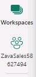

1. On the workspace page, select **+ New item**.

    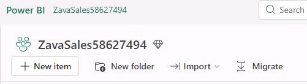

1. In the New item window, in the **Get data** section, select **Eventstream**.

    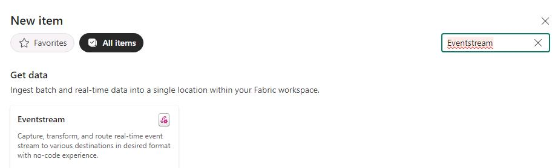

1. In the Name field, enter `RealtimeDataToKQLDB@lab.LabInstance.Id` and then select **Create**.

    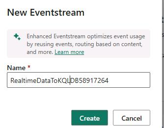

1. On the Eventstream canvas, select **Connect data sources**.

    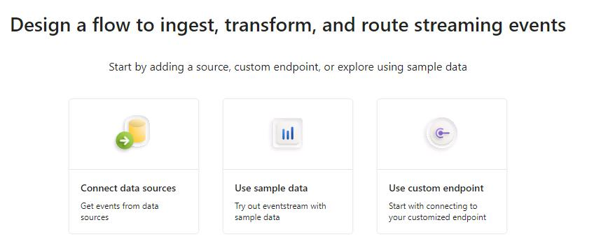

1. In the **Select a data source** dialog, select **evh-@lab.LabInstance.Id**.

    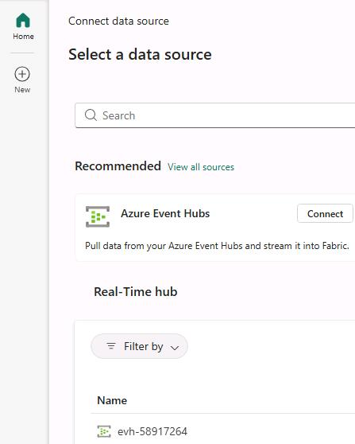

1. In the configure connection settings dialog, in the **Select an Azure Event Hubs** field, select **thermostat**.

1. In the **Select an Azure Event Hub Key** field, select **RootManagedSharedAccessKey**.

    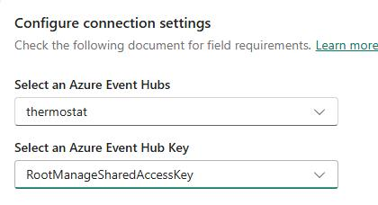

1. Select **New Connection**.

    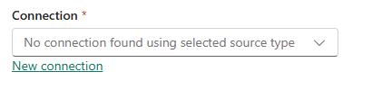

1. Select **Connect**.

    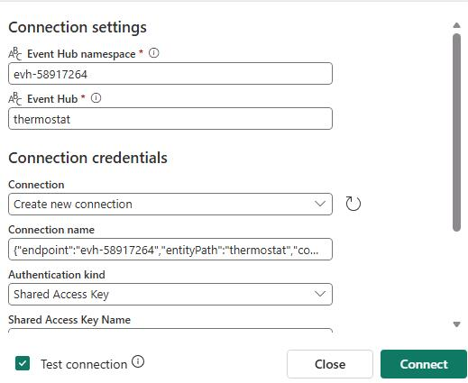

    {: .note }
    > The values for the **Connection settings** dialog should be prepopulated for you.

1. Select **Next**.

    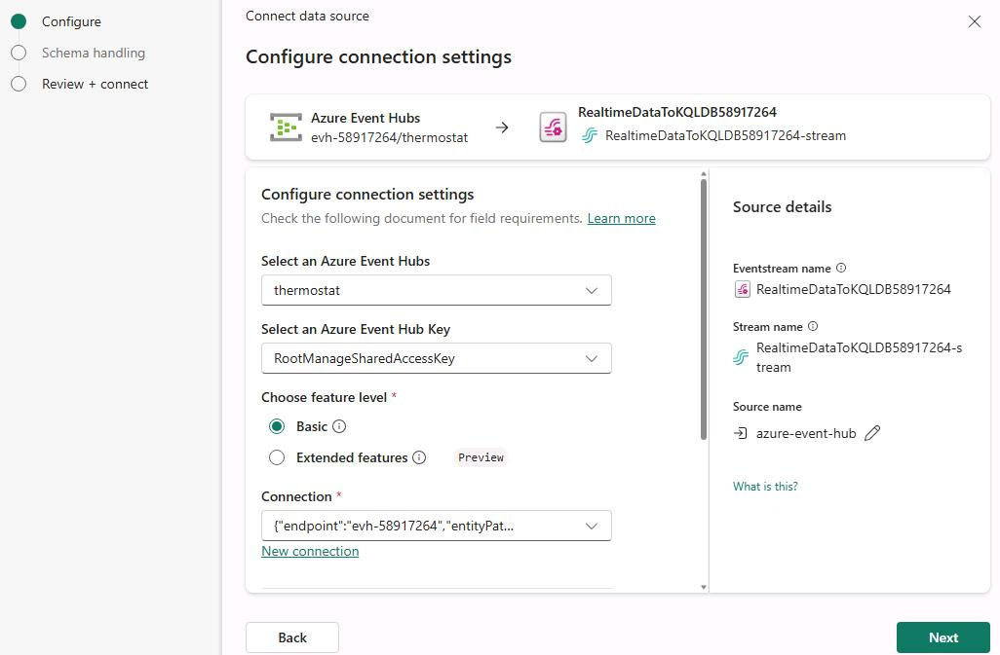

1. Select **Add**.

    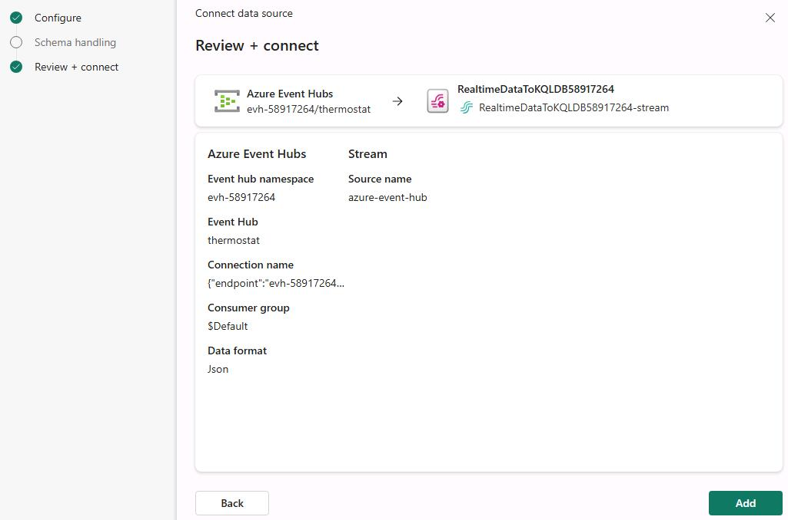
 
1. On the command bar, select **Add destination** and then select **Eventhouse**.

    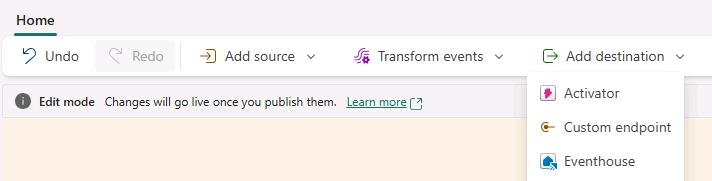

1. Configure the **Eventhouse** pane by using the following information:

    | Field | Value |
    |---------|---------|
    | Destination name   | `Eventhouse@lab.LabInstance.Id`   |
    | Workspace   | `ZavaSales@lab.LabInstance.Id`   |
    | Eventhouse   | **thermostat**   |
    | KQL database   | **thermostat**   |
    | Table   | **thermostat**   |

   {: .warning }
   > For the **Eventhouse** and **KQL Destination table** fields, you will need to select **Create new** to add the resource.

   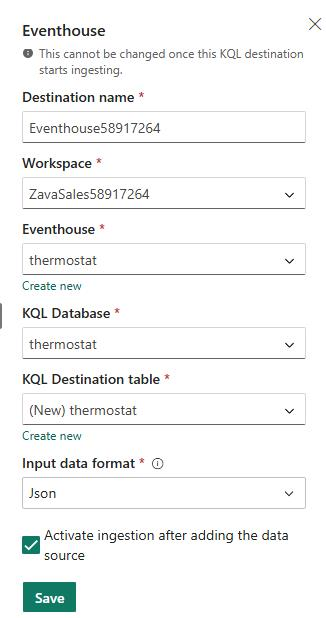

1. Select **Save**.

    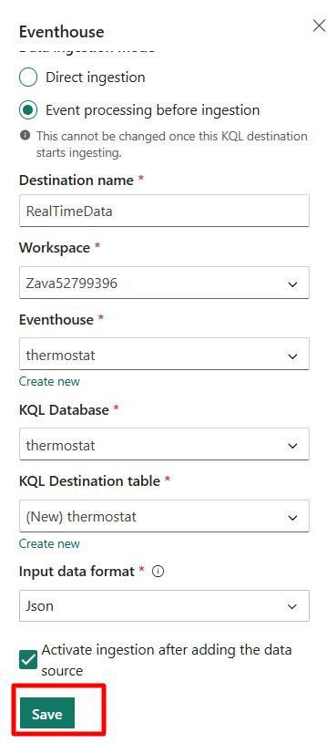

1. Select **Publish**.

    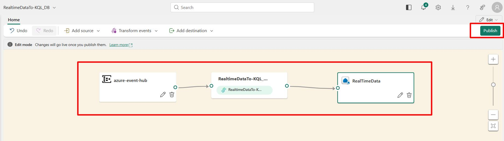

1. Once the data starts streaming into EventHub, you can see the data in the **Data preview** pane that appears at the bottom of the window.

    {: .note }
    > It may take several minutes before you start seeing data. On the design canvas, the status for the **Eventhouse@lab.LabInstance.Id** node changes from **Loading** to **Ready** once the resources are ready to ingest data.
    >
    > 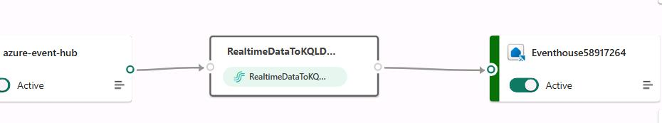

1. Do not proceed to Task 3 until the Data preview pane displays records.

    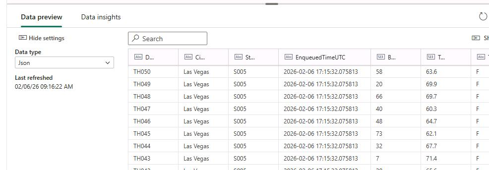