## Task 03: Analyze data by using KQL and anomaly detection

### Introduction
Once data is streaming into the KQL database, you can analyze it using KQL and configure alerts for anomalies.

### Description
In this task, you'll query streaming data and configure anomaly detection and alerts.

### Example scenario
Sudden temperature drops may indicate equipment failure and require immediate attention.

### Success criteria
Queries return results and alerts trigger when conditions are met.

### Learning resources
*   Kusto Query Language (KQL) basics
*   Anomaly detection in Fabric


### Key steps

#### 01: Query streaming data and configure anomaly detection

1. Open Microsoft Edge and go to `https://app.powerbi.com/`.

1. If prompted, sign in by using the following credentials:

    | Setting | Value |
    |:---------|:---------|
    | Username   | `@lab.CloudPortalCredential(User1).Username`   |
    | Temporary Access Pass (TAP) token   | `@lab.CloudPortalCredential(User1).AccessToken`   |

1. In the left pane, select the **Zava@lab.LabInstance.Id** workspace.

    


1. In the list of resources, select the **thermostat** KQL database. 

    {: .warning }
    > Be sure to select the **thermostat** KQL database resource and not the **thermostat** Eventhouse resource.

    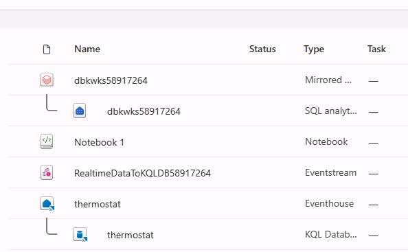

1. On the command bar for the database, select **Query with code**.

    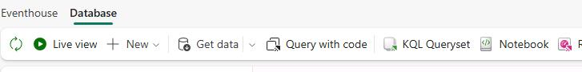

1. On the command bar for the database, select **Copilot**.

    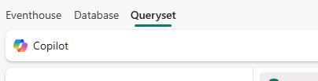

1. Submit the following prompt: 

    ```
    What is the average temperature per day?
    ```

1. In the response from Copilot, select **Copy to clipboard**>

    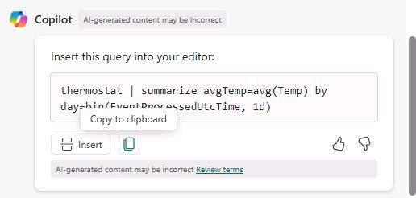
1. Paste the query from Copilot into the query window.

    {: .warning }
    > Sometimes when you paste responses from the Copilot window, in addition to pasting the comments and code, HTML markup gets pasted.
    >
    > 
    >
    > You must remove the HTML markup tags that appear before or after the comments and code.
    >
    > 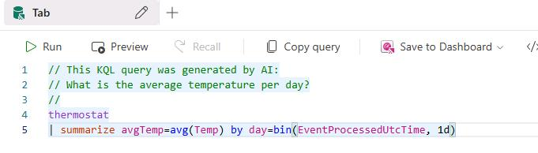

1. On the command bar, select **Run**.

    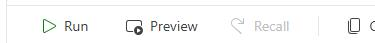

    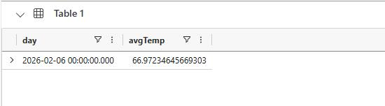

1. In the left pane, select the **Zava@lab.LabInstance.Id** workspace.

    

1. On the command bar, select **+ New item**.

1. Search for `Activator`.

    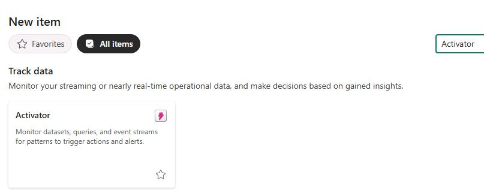

1. Select **Get data**.

    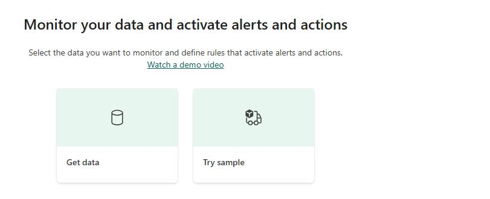

1. In the **Data** section, select **RealtimeDataTo-KQLDB-stream**.

    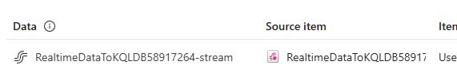

1. Select **Next**.

    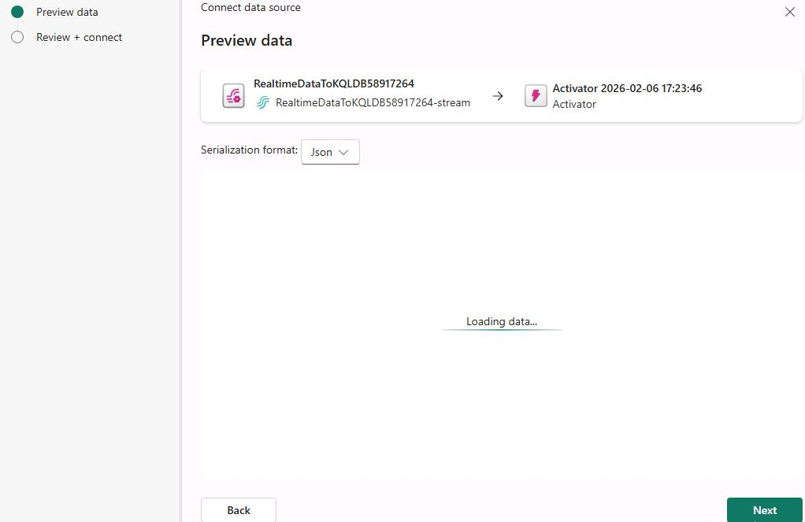

1. []Select **Connect**.

    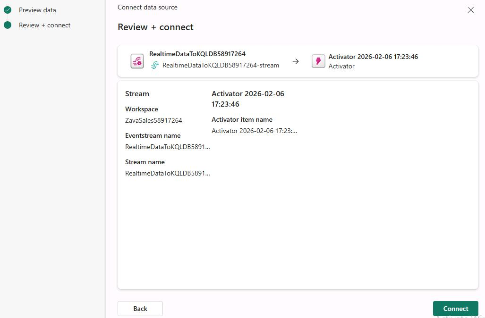

1. Select **Finish**.

    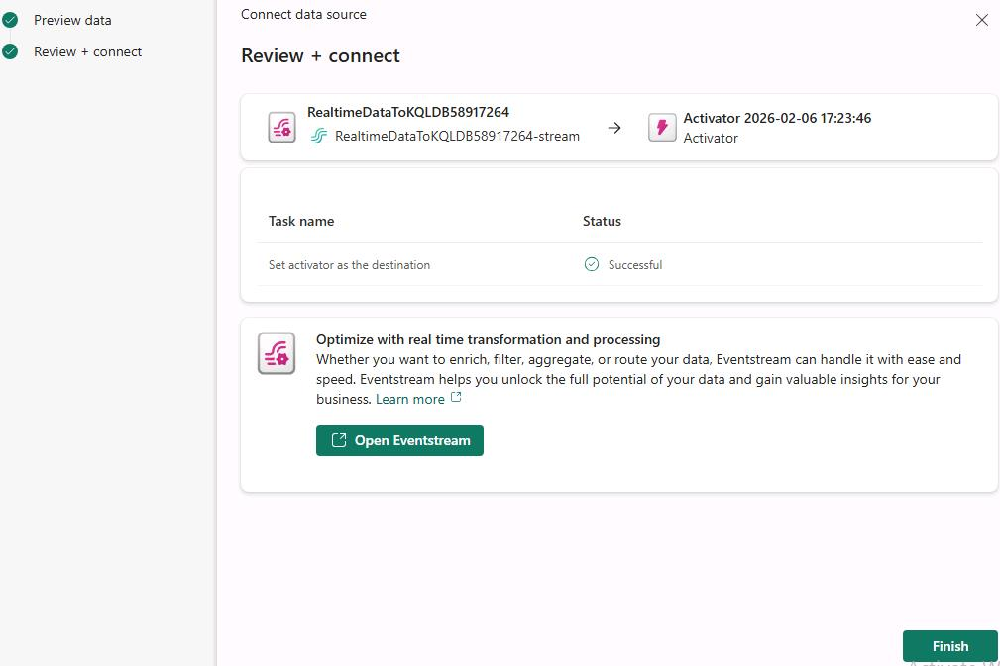

1. Select **New Object**.

    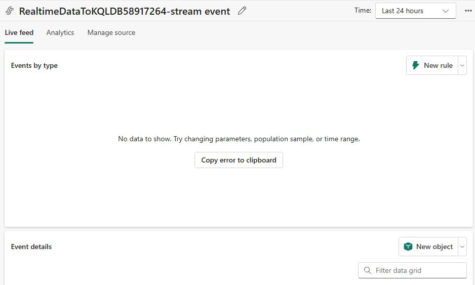

1. Configure the **Build object** pane by using the following information: 

    | Field | Value |
    |---------|---------|
    | Object Name  | **Thermostat**  |
    | Unique identifier   | **Device Id**   |

    {: .warning }
    > You may not be able to enter information into these fields until you start seeing data in the **Event details** pane that appears at the bottom of the window.
    >
    > It may take a couple of minutes before you start seeing data. If you cannot configure the object, close the **Build object** pane and select **New object** to reopen the pane.

1. Select each of the following properties:

    - Battery level
    - City
    - Temp
    - StoreID
    - EnqueuedTimeUTC

1. Select **Create**.

    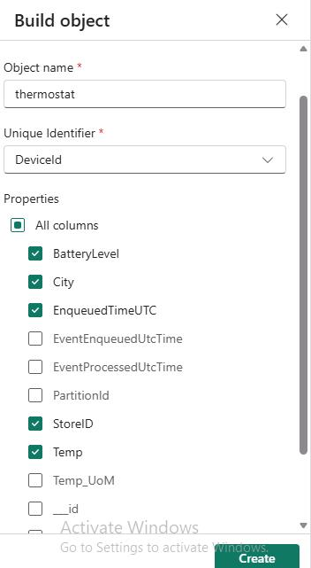

1. In the **Explorer** pane, in the **Thermostat** node, select **Battery level**.

    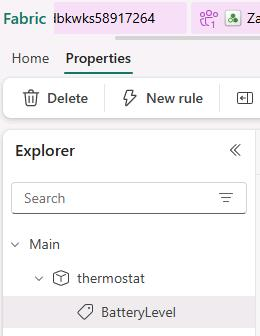

1. In the right pane, select **New rule**.

    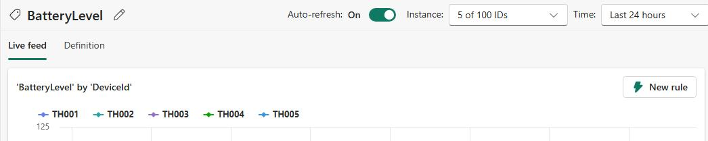

1. Configure the alert rule **Condition** section by using the following information:

    | Field | Value |
    |---------|---------|
    | Condition  | **Decreases below**  |
    | Value  | `10`   |
    | Occurrence  | **Every time the condition is met**   |

    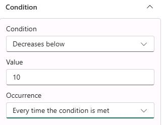

1. Select **Save and Start**.

    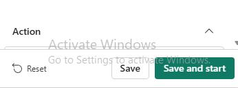

1. Once we have streaming data which matches with the alert condition we should start seeing **Email actions** getting triggered.
