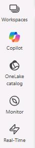
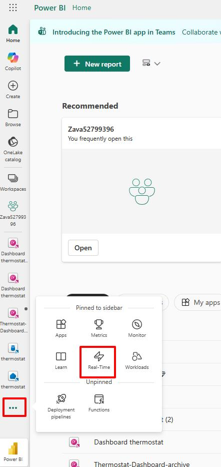
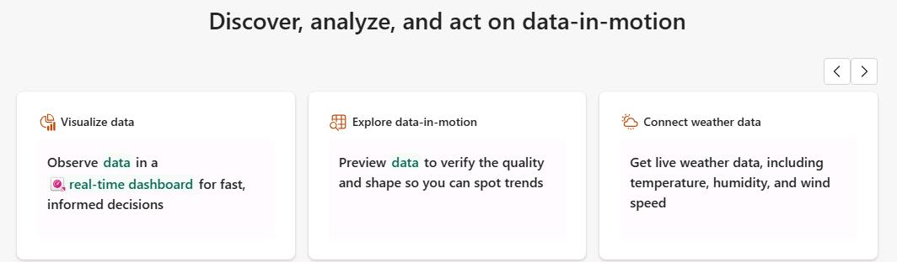
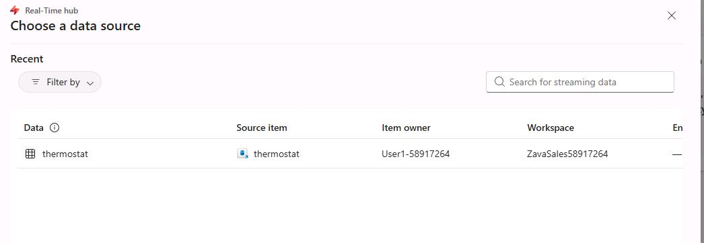
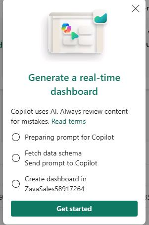

## Task 04: Create a real-time dashboard by using Copilot

### Introduction
Real-time dashboards provide immediate visibility into streaming data using visuals that update automatically.

### Description
In this task, you'll use Microsoft Fabric real-time intelligence and Copilot to create a real-time dashboard based on a streaming table named **thermostat**.

### Example scenario
Operations leaders monitor live dashboards during critical sales events.

### Success criteria
A real-time dashboard displays live telemetry data.

### Learning resources
-   Real-time dashboards in Fabric
-   Copilot for real-time analytics

### Key steps

#### 01: Create a real-time dashboard from streaming telemetry

1. Open Microsoft Edge and go to [Power BI](https://app.powerbi.com/).

1. If prompted, sign in by using the following credentials:

    | Setting | Value |
    |:---------|:---------|
    | Username   | `@lab.CloudPortalCredential(User1).Username`   |
    | Temporary Access Pass (TAP) token   | `@lab.CloudPortalCredential(User1).AccessToken`   |

1. From the left navigation bar, select **Real-Time**. 

    

    {: .note }
    > If the Real-Time hub not visible in the left navigation pane, Select the ellipses (**...**) at the bottom of the left pane. Select **More navigation options**. Locate and select **Real-Time**.

    

1. On the **Real-Time hub** landing page, select the **Visualize data** tile.

    {: .warning }\
    > You may need to select the arrows at the top right of the page to see the tile.

    

1. In the **New Real-Time Dashboard** dialog, in the **Name** field, enter `Thermostat dashboard` and then select **Create**.

	

1. In the **Choose a data source** dialog, select **thermostat** and then select **Choose**.
   
   
   
1. In the confirmation dialog, select **Get started**. Fabric automatically:

    - Connects to the underlying **Eventhouse / KQL Database**
    - Creates a **Real-Time Dashboard**
    - Opens the dashboard editor

    

1. Return to the PowerShell window that you launched in Task 1 and stop the simulator by using the **Ctrl** + **C** key combination.