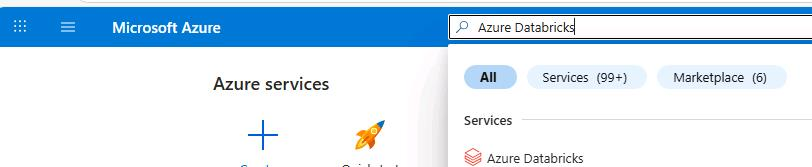
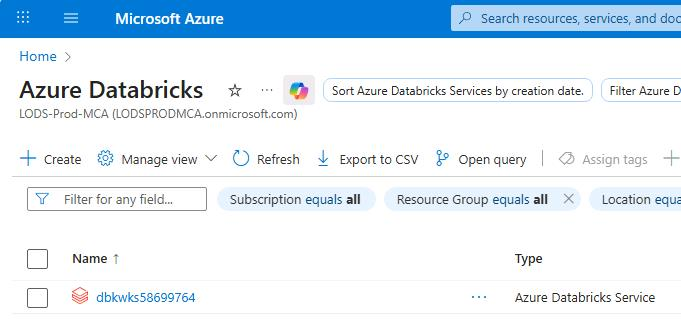
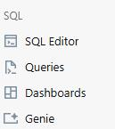
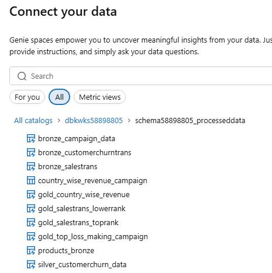
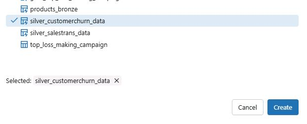
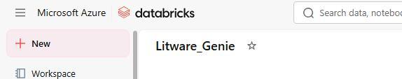
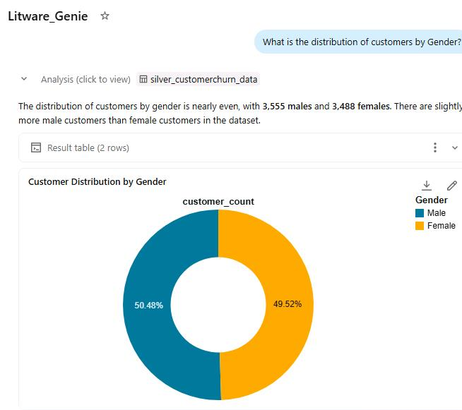
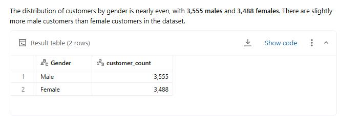
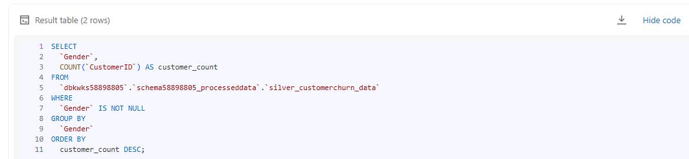

## Task 01: Create an Azure Databricks AI/BI Genie assistant 


### Key steps

1. Open Edge and go to [Microsoft Azure](portal.azure.com) .

1. If prompted, sign in.

1. Search for and then select `Azure Databricks`.

    

1. Select the Azure Databricks resource that was provisioned for you.

    .

1. Select **Launch workspace**.

1. In the **SQL** section, select **Genie**.

    

1. Paste the numbers into a notepad file for later use.

1. On the command bar, select **+ New**.

    

1. In the **Connect your data** dialog, select **dbkwks@lab.LabInstance.Id**, select **schema@lab.LabInstance.Id_processeddata** and then select **silver_customerchurn_data**.

    

1. Select **Create**.

    

1. In the **New space** field, enter `Litware_Genie'.

    

1. In the address bar, copy the GUID that appears after **genie/rooms/** up to **/chats**. This is the Genie Space ID.

    {: .note }
    > For the following sample URL, the ID is **01f102f3fd3214448577687e0fcdd25d**.
    > 
    > https://adb-7405609606849453.13.azuredatabricks.net/genie/rooms/01f102f3fd3214448577687e0fcdd25d/chats/01f102f4405012fd80ac32887916f2ec

1. Submit the following prompt:

    ```
    What is the distribution of customers by Gender?
    ```

1. Review the response.

    

1. Select **Show code**.

    

1. Review the SQL query that was used to generate the results.

    

1. Leave the Azure Databricks page open.