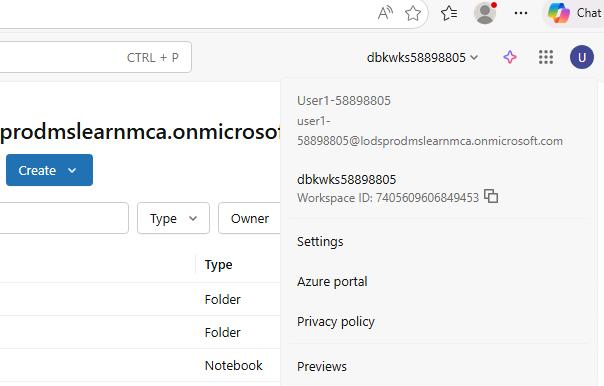
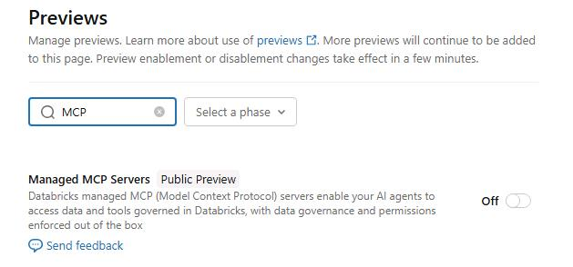
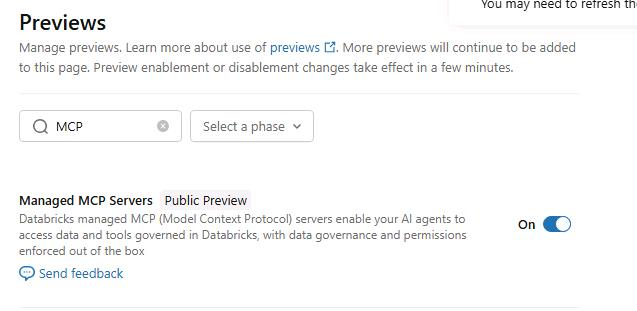
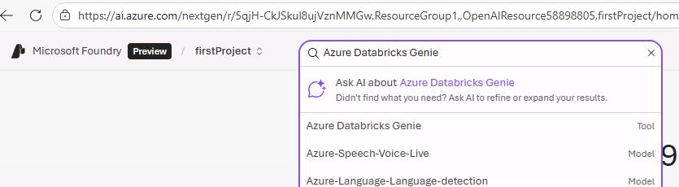
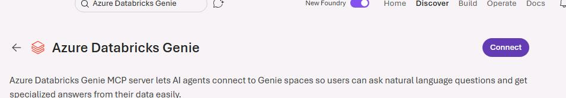
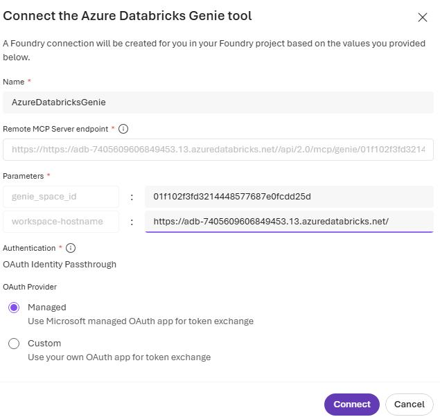
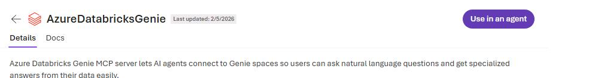

## Task 02: Connect Azure Databricks Genie to Microsoft Foundry

### Introduction
In this task you'll add your Genie MCP server as a tool within Microsoft Foundry

### Key tasks

#### 01: Enable the Managed MCP servers preview.
In this task you will add your Genie MCP server as a tool within Microsoft Foundry

1. On the Azure Databricks page, select your username avatar and then select **Previews**.

    

1. On the **Previews** pane, in the **Filter previews** field, enter `MCP`.

    

1. Set **Managed MCP Servers** to **On**.

    

---

#### 02: Configure Azure Databricks Genie

1. Open a browser tab and go to`https://portal.azure.com.

1. If prompted, sign in by using the following credentials:

    | Setting | Value |
    |:---------|:---------|
    | Username   | `@lab.CloudPortalCredential(User1).Username`   |
    | Temporary Access Pass (TAP) token   | `@lab.CloudPortalCredential(User1).AccessToken`   |

1. In the **Search** field, enter `Resource Groups`. 

    

1. In the list of resource groups, select **ResourceGroup1**.

    

1. In the list of resources, select the **firstproject** project.

    

1. On the page for the project, select **Go to Foundry portal** to launch Microsoft Foundry.

    

1. Search for and select `Azure Databricks Genie`.

    	

1. Select **Connect**.

   

1. Configure the tool by entering the following values and then select **Connect**.

    | Field | Value |
    |---------|---------|
    | Name  | `AzureDatabricksGenie@lab.LabInstance.Id`   |
    | genie_space_id   | `@lab.Variable(GenieSpaceID)`   |
    | workspace-hostname  | @lab.Variable(DatabricksWorkspaceURL)   |
    | OAuth Provider  |**Managed**   |

    

1. Select **Connect**.

1. On the **AzureDatabricksGenie** page, select **Use in an agent**.

    