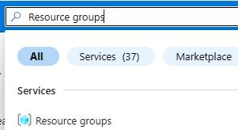
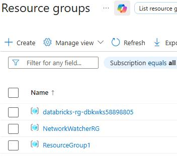
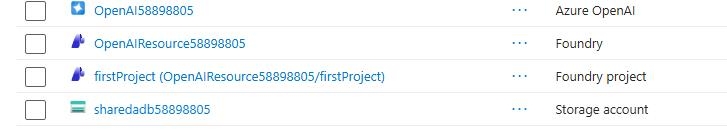
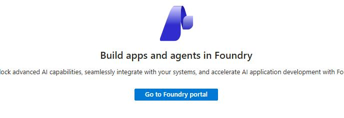

## Task 02: Connect Azure Databricks Genie to Microsoft Foundry

### Introduction
Microsoft Foundry allows AI agents to connect to external tools, including Databricks Genie.

### Description
In this task, you'll add an agent and add your Genie MCP server as a tool. 

### Example scenario
Zava exposes Genie-powered insights through a Foundry agent for broader consumption.

### Success criteria
The Foundry agent successfully queries Genie and returns insights.

### Learning resources
-   Microsoft Foundry agents
-   Tool grounding and orchestration

### Key steps

#### 01: Create a Microsoft Foundry agent

1. Open a browser tab and go to`https://portal.azure.com`.

1. If prompted, sign in by using the following credentials:

    | Setting | Value |
    |:---------|:---------|
    | Username   | `@lab.CloudPortalCredential(User1).Username`   |
    | Temporary Access Pass (TAP) token   | `@lab.CloudPortalCredential(User1).AccessToken`   |

1. In the **Search** field, enter `Resource Groups`. 

    

1. In the list of resource groups, select **ResourceGroup1**.

    

1. In the list of resources, select the **firstproject** project.

    

1. On the page for the project, select **Go to Foundry portal** to launch Microsoft Foundry.

    

1. At the top of the page, set **New Foundry** to **On**.

    

1. On the command bar, select the dropdown arrow next to **firstproject** and then select **Create a new project**.

    

1. Foundry creates a project name. Remove the [-####] suffix from the end of the name.

	{: .note }
    > The created project name will look like this example: **User1-11111111-2222** 
    >
    > Removing the suffix will render the name like this example: **User1-11111111**

1. Expand the **Advanced options** and change the resource group to **ResourceGroup1** if necessary.

1. In the **Create a project** dialog, select **Create**.

	

1. In the confirmation dialog that displays, select **Let's go**.

	

1. In the **Start building** field, select **Create agents**.

    

1. In the **Create an agent** dialog, in the **Agent name** field, enter `Genie-Agent@lab.LabInstance.GlobalId` and then select **Create**.

    

---

#### 02: Connect the agent to the genie

1. In the left pane, select **Tools**.

    

1. On the **Tools** page, select **Connect a tool**.

    

1. In the **Select a tool** dialog, select the **Catalog** tab and then select **Azure Databricks Genie**.

    

1. Select **Create**.

1. Configure the tool by entering the following values and then select **Connect**.

    | Field | Value |
    |---------|---------|
    | Name  | `AzuretGenie@lab.LabInstance.Id`   |
    | genie_space_id   | `@lab.Variable(GenieSpaceID)`   |
    | workspace-hostname  | `@lab.Variable(DatabricksAccountID)`   |
    | OAuth Provider  |**Managed**   |

    

1. On the **AzureGenie** page, select **Use in an agent** and then select **Genie-Agent@lab.LabInstance.GlobalId**.

    

1. On the command bar, select **Publish** and then select **Publish agent**.

    

1. In the confirmation dialog, select **Publish**.

    

1. In the **Agent published successfully** dialog, select **Close**.

    

1. Submit the following prompt:

    `What is the distribution of customers by Gender?`

    {: .note }
    > Azure Databricks Genie in Microsoft Foundry supports up to five questions per minute due to Genie API rate limits.

1. If prompted, sign in by using the following credentials and then select **Allow access**:

    | Setting | Value |
    |:---------|:---------|
    | Username   | `@lab.CloudPortalCredential(User1).Username`   |
    | Temporary Access Pass (TAP) token   | `@lab.CloudPortalCredential(User1).AccessToken`   |

1. In the response from the agent, select **Approve** and then select **Always approve this tool**.

    

1. In the response, select **Debug** to view the conversation flow and tool usage.

    
