## Task 03: Create a Foundry Agent and Chat with Azure Databricks Insights

In this task, you'll create a Foundry agent that uses the Azure Databricks Genie.

1. In Microsoft Foundry, in the left pane, select **Agents**.

    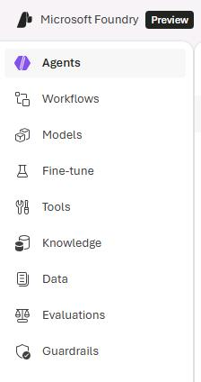

1. Select **Create Agent**.

    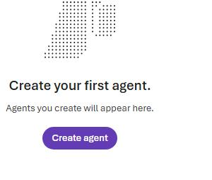

1. In the **Create an agent** dialog, in the **Agent name** field, enter `Genie-Agent@lab.LabInstance.GlobalId` and then select **Create**.

    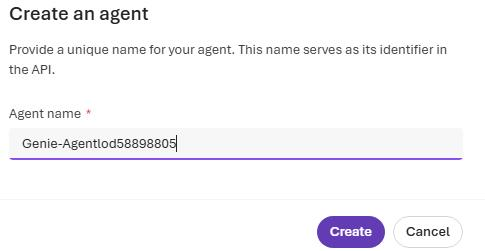

1. In the left pane, select **Tools**.

    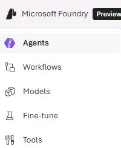

1. Select **AzureDatabricksGenie**.

    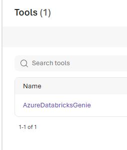

1. Select **Use in an agent** and then select **Genie-Agent@lab.LabInstance.GlobalId**.

    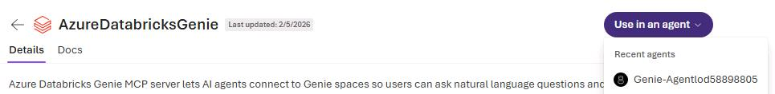

1. On the command bar, select **Publish** and then select **Publish agent**.

    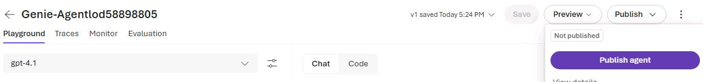

1. In the confirmation dialog, select **Publish**.

    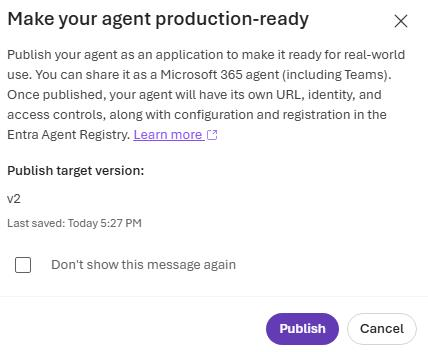

1. In the **Agent published successfully** dialog, select **Close**.

    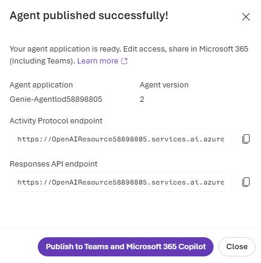

1. Submit the following prompt:

    ```
    What is the distribution of customers by Gender?
    ```

    {: .note }
    > Azure Databricks Genie in Microsoft Foundry supports up to five questions per minute due to Genie API rate limits.


1.  In the response from the agent, select **Approve**.

    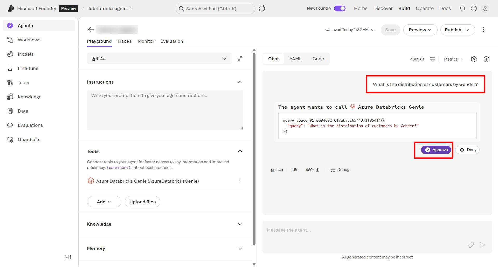

1. In the response, select **Debug** to view the conversation flow and tool usage.

    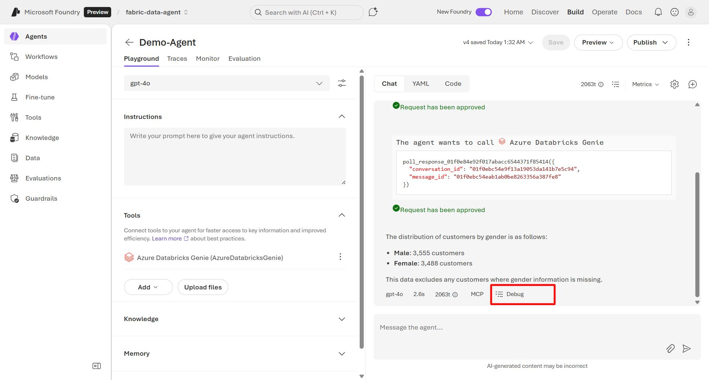

---

## Congratulations!
You've completed this workshop.